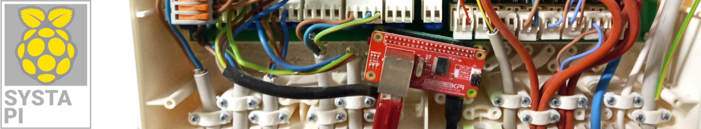
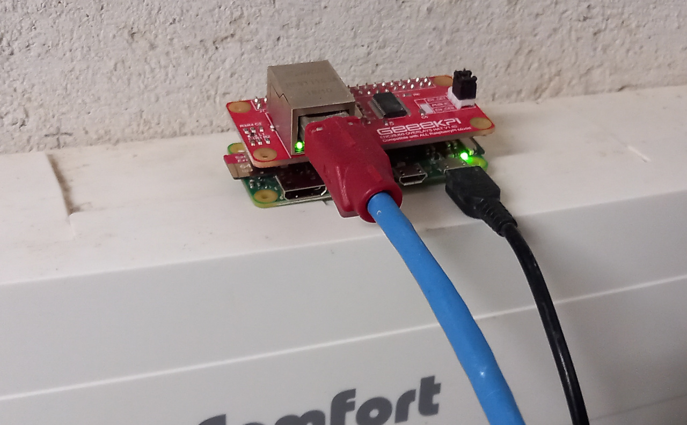
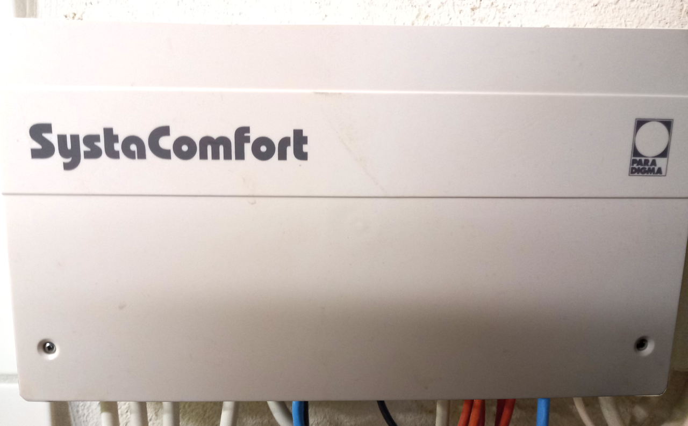
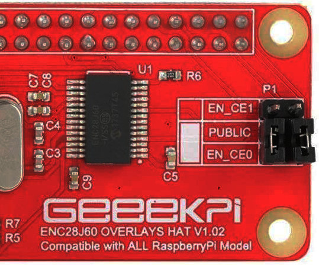
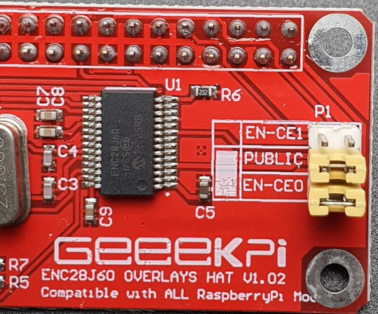

[](https://github.com/beep-projects/SystaPi/issues) [](https://github.com/beep-projects/SystaPi) [](https://github.com/beep-projects/SystaPi/stargazers)  

# SystaPi and SystaREST

SystaPi adds a REST API to [Paradigma SystaComfort II](https://www.paradigma.de/produkte/regelungen/systacomfortll/) units. The intention of this is to make the system compatible with every home automation system that supports REST APIs. The project contains an installation script to setup a Raspberry Pi as SytsaPi for running the SystaREST server. Up to now only reading of values is supported by SystaREST.
Because the communication protocol is not publicly available, the server has a rudimentary logging functionality integrated, so you can set triggers on value changes with your home automation system and start recordings for reverse engineering of the protocol.
This project is inspired by this post on the VDR portal [Heizungssteuerung: Daten auslesen](https://www.vdr-portal.de/forum/index.php?thread/119690-heizungssteuerung-daten-auslesen/) and I also used some information from the [SystaComfortPrometheusExporter](https://github.com/xgcssch/SystaComfortPrometheusExporter).

Build with a Raspberry Pi Zero WH and ENC28J60 Ethernet HAT, the SystaPi fits easily into the housing of the Paradigma SystaComfort II.

  

## Directory Structure of this Project

```
    ├── SystaPi_files           # files required for configuring a Raspberry Pi OS image to run the SystaRESTAPI server
    │   ├── cmdline.txt         # file to be placed under /boot/cmdline.txt on the pi. Triggers the execution of firstrun.sh
    │   │                       # on first boot (actually the second one, after resizing the image)
    │   ├── firstrun.sh         # script for configuring WiFi, keyboard and timezone. You have to configure a few things in here!
    │   ├── secondrun.sh        # called after a reboot. Should have network running. Does a full-upgrade of the system, 
    │   │                       # installs required packages (dnsmasq, OpenJDK) and the SystaRESTAPI.service
    │   └── thirdrun.sh         # called after a reboot. Cleans up after the installation and reboots into the final system
    ├── SystaRESTServer         # Java based server for providing a REST API for a Paradigma SystaComfort II unit
    │   ├── bin                 # precompiled .class files for running the SystaRESTAPI server
    │   ├── doc                 # JavaDoc for the server files
    │   ├── lib                 # .jar files required for running the server
    │   └── src                 # src files of the server, for everyone who wants to improve this
    ├── install_systapi.sh      # Script for automatically downloading, flashing and configuring 
    │                           # a Micro SD card for running the SystaREST server
    ├── LICENSE                 # License for using and editing this software
    └── README.md               # This file
```

## Parts List

This is what I am using for this project, but any Raspberry Pi with one WiFi and one Ethernet interface should do the job. The required size of the Micro SD card depends on the amount of data you want to log. Logging data of one day requires ~100 MB.

* Raspberry Pi Zero WH
* ENC28J60 Ethernet HAT
* Micro SD card >256MB
* Micro USB Powersupply 5V / 1A

## Installation

For easy installation I have created some scripts that configure the Raspberry Pi OS automatically on a Micro SD card. These scripts are not actively maintained, so they might stop working at some time. If auto configuration fails, step through the files `firstrun.sh` and `secondrun.sh` and run the commands manually on your `systapi`.
The installation script sets up IP spoofing for the Ethernet interface `eth0`, so that the Paradigma SystaComfort II starts communicating with the `systapi` instead of [SystaWeb](https://paradigma.remoteportal.de/). It also installs Open JDK for running the SystaREST server.

### Linux

For Linux I provide a script that downloads Raspberry Pi OS and flashes it onto a Micro SD card. The script was mainly written out of curiosity to see how that could work. So it has no added sanity checks and you should use it with care. Check each step, when asked to confirm. If unsure, follow the manual installation guide.

1. Run the following commands in a shell for downloading and unzipping the project files

   ```bash
   wget https://github.com/beep-projects/SystaPi/archive/refs/heads/main.zip
   unzip SystaPi-main.zip
   ```

2. Open `SystaPi-main/SystaPi_files/firstrun.sh` with a text editor and configure everything in the marked section to your liking. 
   Most probably you want to generate your `WPA_PASSPHRASE` via `wpa_passphrase MY_WIFI passphrase` , or  use the [WPA PSK (Raw Key) Generator](https://www.wireshark.org/tools/wpa-psk.html), and add the credentials to the file.

   ```bash
   #-------------------------------------------------------------------------------
   #----------------------- START OF CONFIGURATION --------------------------------
   #-------------------------------------------------------------------------------
   
   # which hostname do you want to give your raspberry pi?
   HOSTNAME=systapi
   # configure the wifi connection
   # the example WPA_PASSPHRASE is generated via
   #     wpa_passphrase MY_WIFI passphrase
   # but you also can enter your passphrase as plain text, if you accept the potential insecurity of that approach
   SSID=MY_WIFI
   WPA_PASSPHRASE=3755b1112a687d1d37973547f94d218e6673f99f73346967a6a11f4ce386e41e
   # configure your timezone and key board settings
   TIMEZONE="Europe/Berlin"
   COUNTRY="DE"
   XKBMODEL="pc105"
   XKBLAYOUT=$COUNTRY
   XKBVARIANT=""
   XKBOPTIONS=""
   # if you want to use an ENC28J60 Ethernet HAT, enable it here
   ENABLE_ENC28J60=true
   
   #-------------------------------------------------------------------------------
   #------------------------ END OF CONFIGURATION ---------------------------------
   #-------------------------------------------------------------------------------
   ```

3. Insert the Micro SD card that you want to get prepared as SystaPi into your computing device

4. Continue in the shell

   ```bash
   cd SystaPi-main
   ./install_systapi.sh
   ```

5. Eject the Micro SD card and insert it into your Raspberry Pi

6. Connect the Raspberry Pi with an Ethernet cable to your Paradigma SystaComfort II

7. Power up the Raspberry Pi

8. Wait a while and then try to load the WADL of the server: [http://systapi:1337/application.wadl?detail=true](http://systapi:1337/application.wadl?detail=true)

### Windows / manual installation

1. Install Raspberry Pi OS following this [guide](https://www.raspberrypi.org/documentation/installation/installing-images/).
   [Raspberry Pi OS Lite](https://www.raspberrypi.org/software/operating-systems/#raspberry-pi-os-32-bit) is sufficient.

2. Download [SystaPi](https://github.com/beep-projects/SystaPi/archive/refs/heads/main.zip)

3. Extract the downloaded zip file

4. Change into the `SystaPi_files` subfolder of the extracted archive

5. Open `firstrun.sh` with a text editor

   Most probably you want to use something like [WPA PSK (Raw Key) Generator](https://www.wireshark.org/tools/wpa-psk.html) and add the generated credentials to the file.

   ```bash
   #-------------------------------------------------------------------------------
   #----------------------- START OF CONFIGURATION --------------------------------
   #-------------------------------------------------------------------------------
   
   # which hostname do you want to give your raspberry pi?
   HOSTNAME=systapi
   # configure the wifi connection
   # the example WPA_PASSPHRASE is generated via
   #     wpa_passphrase MY_WIFI passphrase
   # but you also can enter your passphrase as plain text, if you accept the potential insecurity of that approach
   SSID=MY_WIFI
   WPA_PASSPHRASE=3755b1112a687d1d37973547f94d218e6673f99f73346967a6a11f4ce386e41e
   # configure your timezone and key board settings
   TIMEZONE="Europe/Berlin"
   COUNTRY="DE"
   XKBMODEL="pc105"
   XKBLAYOUT=$COUNTRY
   XKBVARIANT=""
   XKBOPTIONS=""
   # if you want to use an ENC28J60 Ethernet HAT, enable it here
   ENABLE_ENC28J60=true
   
   #-------------------------------------------------------------------------------
   #------------------------ END OF CONFIGURATION ---------------------------------
   #-------------------------------------------------------------------------------
   ```

6. Make sure that the `boot`-partition of the Micro SD card is accessible via file explorer

7. Copy all files from the `SystaPi_files` subfolder to `boot`-partition of the Micro SD card

8. Copy the `SystaRESTServer` folder and all its contents to the `boot`-partition.

9. Eject the Micro SD card and insert it into your Raspberry Pi

10. Connect the Raspberry Pi with an Ethernet cable to your Paradigma SystaComfort II

11. Power up the Raspberry Pi

12. Wait a while and then try to load the WADL of the server: [http://systapi:1337/application.wadl?detail=true](http://systapi:1337/application.wadl?detail=true)

### Troubleshooting the installation

1. The autoconfig of the Raspberry Pi OS worked fine when I did the commit for it. But if development of Raspberry Pi OS goes on, the scripts might break. If you connect the Raspberry Pi to a screen via HDMI, you see if something gets wrong
2. If you do not know where the install script died on the Raspberry Pi, have a look at the `/boot` folder. The files `firstrun.sh`, `secondrun.sh` and `thirdrun.sh`  are stored there and run one after each other. After a successful run, each of the files removes itself. So the first file not deleted, is the one that failed
3. SystaRESTServer is installed as a service on the raspberry pi. `systemctl status SystaRESTServer.service` will show you if the service is running or died for some reason

## The SystaREST API

Per default, the SystaREST server is listening on port `1337`, you can change this by editing `/home/pi/SystaRESTServer/bin/SystaREST.properties`.
The hostname of the Raspberry Pi is set to `systapi`.
The path and method names on the REST server are implemented case insensitive.
The root path is: `systarest`, or `SystaREST`, or any variation you like.
So you should be able to access the server via `http://systapi:1337/SystaREST/`. This base URL will be used for the following examples and should work for most network configurations. If not, you have to replace `systapi` with the URL assigned by your router. The server provides a WADL of the provided API at: [http://systapi:1337/application.wadl?detail=true](http://systapi:1337/application.wadl?detail=true)
If a command is called which should retrieve data from the SystaREST, but the communication is not running, `start` is automatically called, but the reply will be empty until the first data packet is received from the Paradigma Systa Comfort II. Data packets are sent every minute.

#### start

`POST` `/SystaREST/start` start communication with the connected Paradigma SystaComfort II

````bash
curl -X POST http://systapi:1337/SystaREST/start
````

#### stop

`POST` `/SystaREST/stop`  stop communication with the connected Paradigma SystaComfort II

````bash
curl -X POST http://systapi:1337/SystaREST/stop
````

#### servicestatus

`GET` `/SystaREST/servicestatus`
[http://systapi:1337/SystaREST/servicestatus](http://systapi:1337/SystaREST/servicestatus)
Returns the status of the SystaREST server

```json
{
    "connected":true,
    "running":true,
    "lastDataReceivedAt":"Wed-30.06.21-00:00:19",
    "packetsReceived":234,
    "paradigmaListenerIP":"192.168.1.1",
    "paradigmaListenerPort":22460,
    "paradigmaIP":"192.168.1.23",
    "paradigmaPort":8002,
    "loggingData":false,
    "logFileSize":60,
    "logFilePrefix":"SystaREST",
    "logFileDelimiter":";",
    "logFileRootPath":"/home/pi/SystaRESTServer/bin/",
    "logFilesWritten":0,
    "logBufferedEntries":60
}
```

#### rawdata

`GET` `/SystaREST/rawdata`
[http://systapi:1337/SystaREST/rawdata](http://systapi:1337/SystaREST/rawdata)
Returns the raw data received from the Paradigma Systa Comfort II with added timestamp information.

```json
{
    "timestamp":1623836832,
    "timestampString":"Wed-16.06.21-09:47:12",
    "rawData":[
        250,
        273,
        277,
        736,
        650,
        565,
        -300,
        -300,
        -300,
        0,
        0,
        0,
        332,
        ... (250 entries) ...
    ]
}
```

#### waterheater

`GET` `/SystaREST/waterheater`
[http://systapi:1337/SystaREST/waterheater](http://systapi:1337/SystaREST/waterheater)
Returns the information for a Home Assistant [https://developers.home-assistant.io/docs/core/entity/water-heater/](Water Heater)

```json
{
    "min_temp":40.0,
    "max_temp":65.0,
    "current_temperature":71.0,
    "target_temperature":0.0,
    "target_temperature_high":85.0,
    "target_temperature_low":0.0,
    "temperature_unit":"TEMP_CELSIUS",
    "current_operation":"locked",
    "operation_list":[
        "off",
        "normal",
        "comfort",
        "locked"
    ],
    "supported_features":[
    ],
    "is_away_mode_on":false,
    "timestamp":1623675405,
    "timestampString":"Mon-14.06.21-12:56:45"
}
```

#### status

`GET` `/SystaREST/status`
[http://systapi:1337/SystaREST/status](http://systapi:1337/SystaREST/status)
Returns all known fields from the received data.

```json
{
    "outsideTemp":16.2,
    "circuit1FlowTemp":26.9,
    "circuit1ReturnTemp":27.7,
    "hotWaterTemp":66.6,
    "bufferTempTop":66.0,
    "bufferTempBottom":63.6,
    "circulationTemp":-30.0,
    "circuit2FlowTemp":-30.0,
    "circuit2ReturnTemp":-30.0,
    "roomTempActual1":0.0,
    "roomTempActual2":0.0,
    "collectorTempActual":0.0,
    "boilerFlowTemp":24.8,
    "boilerReturnTemp":24.8,
    "stoveFlowTemp":22.7,
    "stoveReturnTemp":32.3,
    "woodBoilerBufferTempTop":-30.2,
    "swimmingpoolTemp":0.0,
    "swimmingpoolFlowTeamp":0.0,
    "swimmingpoolReturnTemp":0.0,
    "hotWaterTempSet":0.0,
    "roomTempSet1":0.0,
    "circuit1FlowTempSet":0.0,
    "circuit2FlowTempSet":0.0,
    "roomTempSet2":0.0
    "bufferTempSet":0.0
    "boilerTempSet":0.0
    "operationMode":7
    "operationModeName":"Off"
    "roomTempSetNormal":21.0
    "roomTempSetComfort":24.0
    "roomTempSetLowering":18.0
    "heatingOperationMode":0
    "heatingOperationModeName":"off"
    "controlledBy":0
    "controlMethodName":"external temp"
    "heatingCurveBasePoint":34.0
    "heatingCurveGradient":0.4
    "maxFlowTemp":60.0
    "heatingLimitTemp":15.0
    "heatingLimitTeampLowering":15.0
    "antiFreezeOutsideTemp":2.0
    "heatUpTime":30
    "roomImpact":0.0
    "boilerSuperelevation":0
    "spreadingHeatingCircuit":20.0
    "heatingMinSpeedPump":100
    "mixerRuntime":2
    "roomTempCorrection":0.0
    "underfloorHeatingBasePoint":35.0
    "underfloorHeatingGradient":1.3
    "hotWaterTempNormal":55.0
    "hotWaterTempComfort":60.0
    "hotWaterOperationMode":3
    "hotWaterOperationModeName":"locked"
    "hotWaterHysteresis":5.0
    "hotWaterTempMax":65.0
    "pumpOverrun":10
    "bufferTempMax":85.0
    "bufferTempMin":1.0
    "boilerHysteresis":5.0
    "boilerOperationTime":5
    "boilerShutdownTemp":25.0
    "boilerMinSpeedPump":25
    "circulationPumpOverrun":3
    "circulationHysteresis":5.0
    "adjustRoomTempBy":0.0
    "boilerOperationTimeHours":3885
    "boilerOperationTimeMinutes":48
    "numberBurnerStarts":2414
    "solarPowerActual":0.0
    "solarGainDay":0.0
    "solarGainTotal":0.0,"countdown":0
    "relay":2048
    "heatingPumpIsOn":false
    "chargePumpIsOn":false
    "circulationPumpIsOn":false
    "boilerIsOn":false
    "burnerIsOn":false
    "unknowRelayState1IsOn":false
    "unknowRelayState2IsOn":false
    "unknowRelayState3IsOn":false
    "unknowRelayState4IsOn":false
    "unknowRelayState5IsOn":true
    "error":65535
    "operationModeX":7
    "heatingOperationModeX":0
    "stovePumpSpeedActual":0
    "timestamp":1625268469,
    "timestampString":"Fri-02.07.21-23:27:49"
}
```

#### enablelogging

`PUT` `/SystaREST/enablelogging`
enables the logging of each received data element to a delimited log file. To reduce the number of file writes, this function stores `entriesPerFile` data segments in memory and then writes them into a single file. If logging is not enabled, SystaREST still stores the last `entriesPerFile` data segments in memory and saves them to the disc as soon as logging gets enabled. This feature shall help to implement triggers for value changes of interest, by also saving data that has been received before the interesting event happened.

Optional parameters:

* `filePrefix` default `SystaREST`
* `logEntryDelimiter` default `;`
* `entriesPerFile` default `60

```bash
curl -X PUT "http://systapi:1337/SystaREST/enablelogging?filePrefix=SystaREST&logEntryDelimiter=;&entriesPerFile=1337"
```

#### disablelogging

`PUT` `/SystaREST/disablelogging`
stop the logging of received data packets. This writes all currently stored data segments to a file and stops the writing to disc.

```bash
curl -X PUT http://systapi:1337/SystaREST/disblelogging
```


## Known Issues

There are some ENC28J60 modules around with wrong jumper settings. Make sure you set the jumpers as in the picture on the left (vertically connecting the PINs).

| correct                                                   | wrong                                                   |
| --------------------------------------------------------- | ------------------------------------------------------- |
|  |  |


## Links

* [Paradigma Downloads](http://www.paradigma.de/software/)
* [Heizungssteuerung: Daten auslesen](https://www.vdr-portal.de/forum/index.php?thread/119690-heizungssteuerung-daten-auslesen/)
* [SystaComfortPrometheusExporter](https://github.com/xgcssch/SystaComfortPrometheusExporter)

