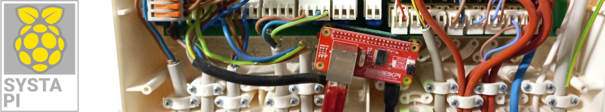
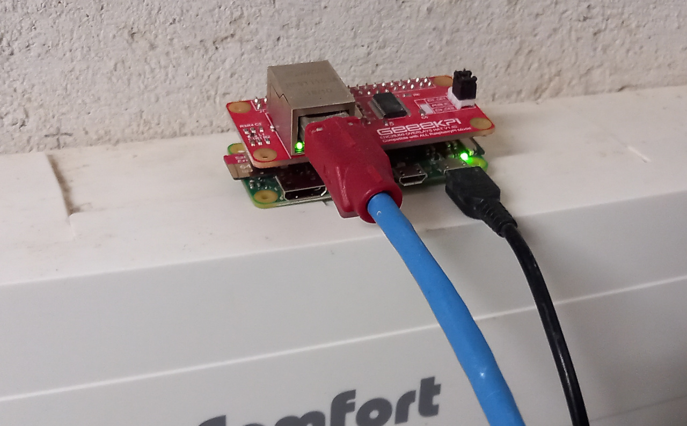
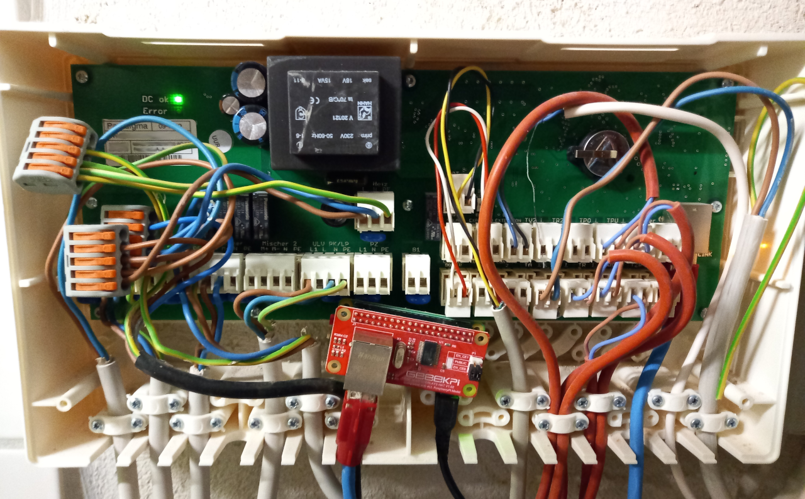
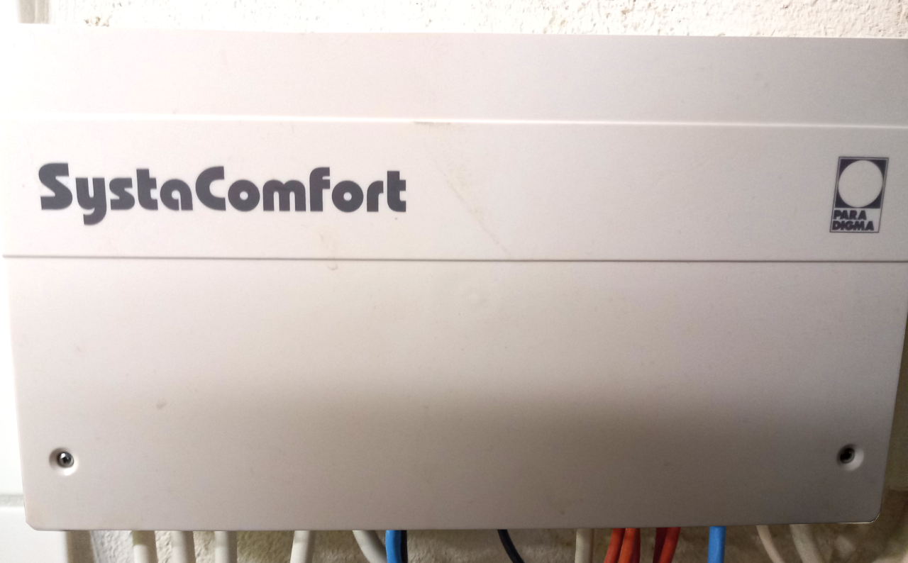
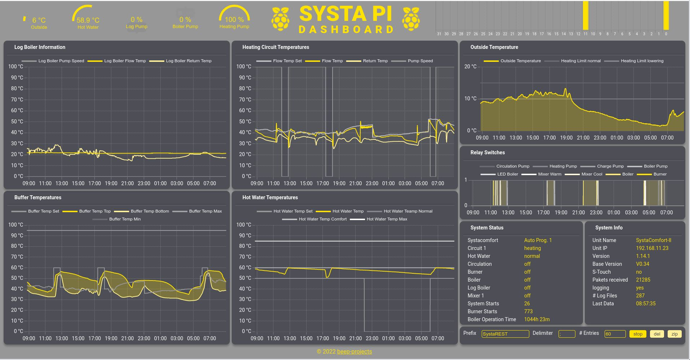
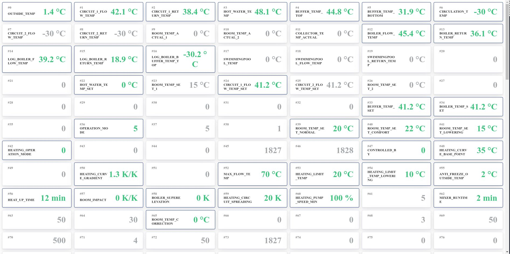
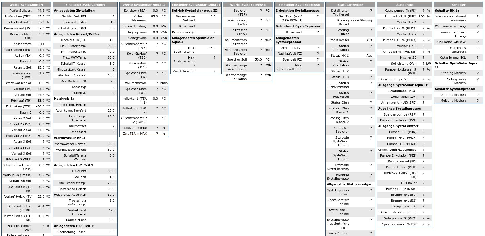
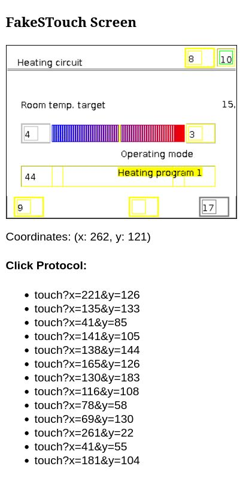
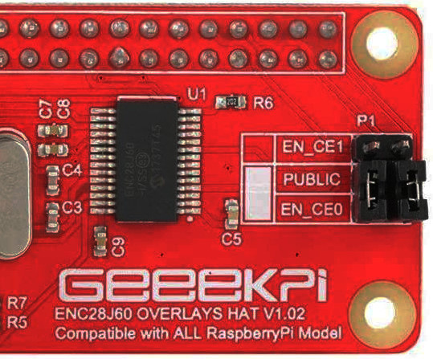
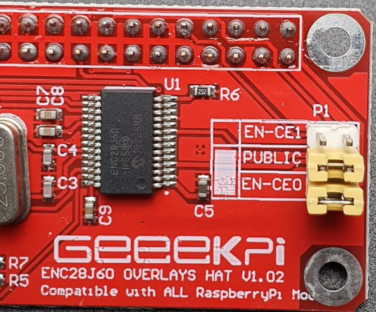

<div align="center">

</div>

<sup>Code:</sup> [](https://github.com/beep-projects/SystaPi/blob/main/LICENSE) [](https://github.com/beep-projects/SystaPi/) [](https://github.com/beep-projects/SystaPi/) [](https://github.com/beep-projects/SystaPi/) [](https://github.com/beep-projects/SystaPi/) [](https://github.com/beep-projects/SystaPi/)  
<sup>Checks:</sup> [](https://github.com/beep-projects/SystaPi/actions/workflows/junit.yml) [](https://github.com/beep-projects/SystaPi/actions/workflows/shellcheck.yml) [](https://github.com/beep-projects/SystaPi/actions/workflows/pylint.yml)  
<sup>Repo:</sup> [](https://github.com/beep-projects/SystaPi/issues) [](https://github.com/beep-projects/SystaPi/network) [](https://github.com/beep-projects/SystaPi/stargazers)  [](https://visitorbadge.io/status?path=beep-projects%2FSystaPi)

# SystaPi, SystaREST and STouchREST

**SystaPi** provides a REST API for communication with [Paradigma SystaComfort](https://www.paradigma.de/produkte/regelungen/systacomfortll/) units. The goal of this project is to make the Paradigma system compatible with every home automation system that supports REST APIs.
The project contains an installation script to setup a Raspberry Pi as SystaPi for running the SystaREST server. The server is running two services, SystaRESTAPI for reading values from the Sytsa Comfort unit and STouchRESTAPI for writing to the Systa Comfort, e.g. selecting the operation mode.  
**Important Note:** The communication protocols use by the Systa Comfort unit are not publicly available! Everything here is based on [reverse engineering](resources/protocols.md) and will only work for systems that are used by contributors. **Please [contribute](#contribute) information from your system!**  

This project is inspired by this post on the VDR portal [Heizungssteuerung: Daten auslesen](https://www.vdr-portal.de/forum/index.php?thread/119690-heizungssteuerung-daten-auslesen/) and I also used some information from the [SystaComfortPrometheusExporter](https://github.com/xgcssch/SystaComfortPrometheusExporter).  

Build with a Raspberry Pi Zero WH and ENC28J60 Ethernet HAT, the SystaPi fits easily into the housing of the Paradigma SystaComfort.  
</img> </img> </img> 

## Content

- [Directory Structure of this Project](#directory-structure-of-this-project)
- [Parts List](#parts-list)
- [Installation](#installation)
  - [SystaComfort](#systacomfort)
  - [Linux](#linux)
  - [Windows / manual installation](#windows--manual-installation)
  - [Troubleshooting the installation](#troubleshooting-the-installation)
- [The SystaREST API](#the-systarest-api)
  - [findsystacomfort](#findsystacomfort)
  - [start](#start)
  - [stop](#stop)
  - [servicestatus](#servicestatus)
  - [rawdata](#rawdata)
  - [dashboard](#dashboard)
  - [monitorrawdata](#monitorrawdata)
  - [waterheater](#waterheater)
  - [status](#status)
  - [enablelogging](#enablelogging)
  - [disablelogging](#disablelogging)
- [The STouchREST API](#the-stouchrest-api)
  - [connect](#connect)
  - [disconnect](#disconnect)
  - [touch](#touch)
  - [screen](#screen)
  - [debugscreen](#debugscreen)
  - [objecttree](#objecttree)
  - [touchbutton](#touchbutton)
  - [touchtext](#touchtext)
  - [automation](#automation)
- [Contribute](#contribute)
- [Known Issues](#known-issues)
- [Links](#links)

## Directory Structure of this Project

```
SystaPi
├── docs                 # JavaDoc for the SystaRESTServer, best accessed via https://beep-projects.github.io/SystaPi/
├── helpers              # collection of resources that are helpful for reverse engineering the SystaComfort protocol
│                        # or setting up systapi
├── install_systapi.sh   # Script for automatically downloading, flashing and configuring 
│                        # a Micro SD card for running the SystaREST server
├── LICENSE              # License for using and editing this software
├── README.md            # This file
├── resources            # folder for images or other files linked with README.md
├── SystaPi_files        # files required for configuring a Raspberry Pi OS image to run the SystaRESTAPI server
│   ├── cmdline.txt      # file to be placed under /boot/cmdline.txt on the pi. Triggers the execution of firstrun.sh
│   │                    # on first boot (actually the second one, after resizing the image)
│   ├── firstrun.sh      # script for configuring WiFi, keyboard and timezone. You have to configure a few things in here!
│   ├── secondrun.sh     # called after a reboot. Should have network running. Does a full-upgrade of the system, 
│   │                    # installs required packages (dnsmasq, OpenJDK) and the SystaRESTAPI.service
│   └── thirdrun.sh      # called after a reboot. Cleans up after the installation and reboots into the final system
└── SystaRESTServer      # Java based server for providing a REST API for a Paradigma SystaComfort unit
    ├── bin              # precompiled .class files for running the SystaRESTAPI server
    ├── build.sh         # build file for compiling SystaRESTServer
    ├── build_test.sh    # build file for building the JUnit test run at each commit
    ├── lib              # .jar files required for running the server
    └── src              # src files of the server, for everyone who wants to improve this
```

## Parts List

This is what I am using for this project, but any Raspberry Pi with at least one Ethernet interface and a second WiFi or Ethernet interface should do the job. The required size of the Micro SD card depends on the amount of data you want to log. Logging data of one day requires ~100 MB.

* Raspberry Pi Zero WH
* ENC28J60 Ethernet HAT
* Micro SD card >256MB
* Micro USB Powersupply 5V / 1A

Of course you also need a Paradigma SystaComfort or Paradigmy SystaComfort II. The following are the paradigma software versions that I succesfully used with **SystaPi** (#1, #2) or that where reported to work (#3)

|                  |   |        #1        |   |       #2          |   |       #3          |
|------------------|---|------------------|---|-------------------|---|-------------------|
| **SystaComfort** |   | `V1.14  8.08.14` |   | `V1.26  10.02.20` |   | `V1.12  20.05.14` |
| **System**       |   | `V2.09.2`        |   | `V2.16.1`         |   | `V2.09.1`         |
| **Basis**        |   | `V0.23`          |   | `V0.34`           |   | `V0.23`           |

## Installation

For easy installation I have created some scripts that configure the Raspberry Pi OS automatically on a Micro SD card. These scripts are not actively maintained, so they might stop working at some time. If auto configuration fails, step through the files `firstrun.sh` and `secondrun.sh` and run the commands manually on your `systapi`. Your are also welcome to fix the scripts and create a pull request to this repository.

Once the Micro SD card is prepared as described in the next sections, the scripts should do the following on first boot ups of the Raspberry Pi: 
* resize the Raspberry Pi OS partition to use the full size of the Micro SD card
* configure WiFi on interface `wlan0`
* `apt full-upgrade` the system
* install `dnsmasq`
* configure `dnsmasq` and `dhcpd` for IP spoofing on interface `eth0`\
  (this will make the Paradigma SystaComfort to communicate with `systapi` instead of [SystaWeb](https://paradigma.remoteportal.de/)
* install OpenJDK 11 from [https://www.azul.com/downloads/?package=jdk#download-openjdk](https://www.azul.com/downloads/?package=jdk#download-openjdk)\
  (this is the most current one you can get for the ARMv6 of the Raspberry Pi Zero)
* install the `systemd` service unit `SytsaRESTServer.service` for automatically starting the SystaRESTServer

### SystaComfort
You have to make sure that your Paradigma SystaComfort unit is sending unencrypted data to [paradigma.remoteportal.de](http://paradigma.remoteportal.de/). If you are one of the unlucky ones, that got a SystaComfort installed with encryption enabled, or the remote portal being disable, you have to get hold of the SystaService software. You can ask Paradigma for that, or your system installer. See also the instructions for setting up the SystaComfortPrometheusExporter
 [english](https://github.com/xgcssch/SystaComfortPrometheusExporter#configure-systacomfort-controller)/[german](https://github.com/xgcssch/SystaComfortPrometheusExporter/blob/main/README_de.md#voraussetzungen)

### Linux

For Linux I provide a script that downloads Raspberry Pi OS and flashes it onto a Micro SD card. The script was mainly written out of curiosity to see how that could work. So it has no added sanity checks and you should use it with care. Check each step, when asked to confirm. If unsure, follow the manual installation guide.

1. Run the following commands in a shell for downloading and unzipping the project files

   ```bash
   wget https://github.com/beep-projects/SystaPi/releases/download/2.2/SystaPi-2.2.zip
   unzip SystaPi-2.2.zip
   ```

2. Open `SystaPi-2.2/SystaPi_files/firstrun.sh` with a text editor and configure everything in the marked section to your liking. 
   Most probably you want to generate your `WPA_PASSPHRASE` via `wpa_passphrase MY_WIFI passphrase` , or  use the [WPA PSK (Raw Key) Generator](https://www.wireshark.org/tools/wpa-psk.html), and add the credentials to the file.
   If you use the network `192.168.1.x` for your local network, you should change the `IP_PREFIX` to another IP range, to avoid network collisions
   
   ```bash
   #-------------------------------------------------------------------------------
   #----------------------- START OF CONFIGURATION --------------------------------
   #-------------------------------------------------------------------------------
   
   # which hostname do you want to give your raspberry pi?
   HOSTNAME=systapi
   #username: beep, password: projects
   #you can change the password if you want and generate a new password with
   #Linux: mkpasswd --method=SHA-256
   #Windows: you can use an online generator like https://www.dcode.fr/crypt-hasing-function
   USER=beep
   # shellcheck disable=SC2016
   PASSWD='$5$oLShbrSnGq$nrbeFyt99o2jOsBe1XRNqev5sWccQw8Uvyt8jK9mFR9' #keep single quote to avoid expansion of $
   # configure the wifi connection
   # the example WPA_PASSPHRASE is generated via
   #     wpa_passphrase MY_WIFI passphrase
   # but you also can enter your passphrase as plain text, if you accept the potential insecurity of that approach
   SSID=MY_WIFI
   WPA_PASSPHRASE=3755b1112a687d1d37973547f94d218e6673f99f73346967a6a11f4ce386e41e
   # define the network to use for communication between systapi and Systa Comfort
   # change if you use the same network range on your wifi network
   IP_PREFIX="192.168.1"
   # configure your timezone and key board settings
   TIMEZONE="Europe/Berlin"
   COUNTRY="DE"
   XKBMODEL="pc105"
   XKBLAYOUT=$COUNTRY
   XKBVARIANT=""
   XKBOPTIONS=""
   # if you want to use an ENC28J60 Ethernet HAT, enable it here
   ENABLE_ENC28J60=true
   
   #-------------------------------------------------------------------------------
   #------------------------ END OF CONFIGURATION ---------------------------------
   #-------------------------------------------------------------------------------
   ```
   
3. Insert the Micro SD card that you want to get prepared as SystaPi into your computing device

4. Continue in the shell

   ```bash
   cd SystaPi-2.2
   ./install_systapi.sh
   ```

5. Eject the Micro SD card and insert it into your Raspberry Pi

6. Connect the Raspberry Pi with an Ethernet cable to your Paradigma SystaComfort

7. Power up the Raspberry Pi

8. Wait a while (~20 minutes, depending on the number of system updates available) and then try to load the WADL of the server: [http://systapi:1337/application.wadl?detail=true](http://systapi:1337/application.wadl?detail=true)
    For troubleshooting, you can check the progress by checking the logs. After 5 minutes the resize of the partitions and ```firstrun.sh``` should be finished, so that you can ssh into the **systapi** and watch the installation process. Default user is `beep` with password `projects`.

   ```bash
   ssh -x beep@systapi.local
   tail -f /boot/secondrun.log
   ```

### Windows / manual installation

1. Install Raspberry Pi OS following this [guide](https://www.raspberrypi.com/documentation/computers/getting-started.html#installing-the-operating-system).
   [Raspberry Pi OS Lite](https://www.raspberrypi.org/software/operating-systems/#raspberry-pi-os-32-bit) is sufficient.

2. Download [SystaPi](https://github.com/beep-projects/SystaPi/releases/download/2.2/SystaPi-2.2.zip)

3. Extract the downloaded zip file

4. Change into the `SystaPi_files` subfolder of the extracted archive

5. Open `firstrun.sh` with a text editor and configure everything in the marked section to your liking.
   Most probably you want to use something like [WPA PSK (Raw Key) Generator](https://www.wireshark.org/tools/wpa-psk.html) and add the generated credentials to the file.
   If you use the network `192.168.1.x` for your local network, you should change the `IP_PREFIX` to another IP range, to avoid network collisions

   ```bash
   #-------------------------------------------------------------------------------
   #----------------------- START OF CONFIGURATION --------------------------------
   #-------------------------------------------------------------------------------
   
   # which hostname do you want to give your raspberry pi?
   HOSTNAME=systapi
   #username: beep, password: projects
   #you can change the password if you want and generate a new password with
   #Linux: mkpasswd --method=SHA-256
   #Windows: you can use an online generator like https://www.dcode.fr/crypt-hasing-function
   USER=beep
   # shellcheck disable=SC2016
   PASSWD='$5$oLShbrSnGq$nrbeFyt99o2jOsBe1XRNqev5sWccQw8Uvyt8jK9mFR9' #keep single quote to avoid expansion of $
   # configure the wifi connection
   # the example WPA_PASSPHRASE is generated via
   #     wpa_passphrase MY_WIFI passphrase
   # but you also can enter your passphrase as plain text, if you accept the potential insecurity of that approach
   SSID=MY_WIFI
   WPA_PASSPHRASE=3755b1112a687d1d37973547f94d218e6673f99f73346967a6a11f4ce386e41e
   # define the network to use for communication between systapi and Systa Comfort
   # change if you use the same network range on your wifi network
   IP_PREFIX="192.168.1"
   # configure your timezone and key board settings
   TIMEZONE="Europe/Berlin"
   COUNTRY="DE"
   XKBMODEL="pc105"
   XKBLAYOUT=$COUNTRY
   XKBVARIANT=""
   XKBOPTIONS=""
   # if you want to use an ENC28J60 Ethernet HAT, enable it here
   ENABLE_ENC28J60=true
   
   #-------------------------------------------------------------------------------
   #------------------------ END OF CONFIGURATION ---------------------------------
   #-------------------------------------------------------------------------------
   ```
   
6. Make sure that the `boot`-partition of the Micro SD card is accessible via file explorer

7. Open `cmdline.txt` from the Micro SD card and copy the `root=PARTUUID=`-Number over into the `cmdline.txt` in the `SystaPi_files` subfolder. If you do not do this step, your pi will not boot!

8. Copy all files from the `SystaPi_files` subfolder to `boot`-partition of the Micro SD card

9. Copy the `SystaRESTServer` folder and all of its content to the `boot`-partition.

10. Eject the Micro SD card and insert it into your Raspberry Pi

11. Connect the Raspberry Pi with an Ethernet cable to your Paradigma SystaComfort

12. Power up the Raspberry Pi

13. Wait a while (~20 minutes, depending on the number of system updates available) and then try to load the WADL of the server: [http://systapi:1337/application.wadl?detail=true](http://systapi:1337/application.wadl?detail=true)
For troubleshooting, you can check the progress by checking the logs. After 5 minutes the resize of the partitions and ```firstrun.sh``` should be finished, so that you can ssh into the **systapi** and whatch the installation process.. Default user is `beep` with password `projects`.

    ```bash
    ssh -x beep@systapi.local
    tail -f /boot/secondrun.log
    ```

### Troubleshooting the installation

1. The autoconfig of the Raspberry Pi OS worked fine when I did the commit for it. But if development of Raspberry Pi OS goes on, the scripts might break. If you connect the Raspberry Pi to a screen via HDMI, you will see if something gets wrong.
2. If the pi does not boot, check if you did step 7 in case of a manual installation.
3. If you do not know where the install script died on the Raspberry Pi, have a look into the `/boot` folder via `ls /boot/*.log`. 
Each script creates a log file, so check `firstrun.log`, `secondrun.log` and `thirdrun.log`, to see where the script failed.
4. SystaRESTServer is installed as a service on the raspberry pi. 
`systemctl status SystaRESTServer.service` will show you if the service is running or died for some reason

## The SystaRESTServer
Per default, the SystaREST server is listening on port `1337`, you can change this by editing `/home/pi/SystaRESTServer/bin/SystaREST.properties`.
The hostname of the Raspberry Pi is set to `systapi`.
There are two services running by default. The first one is SystaREST for reading values from a Systa Comfort unit and the second one is STouchREST which emulates the S-Touch app for providing write access to the Systa Comfort unit.
The paths and method names on the REST server are implemented case insensitive.
The root path for the both services are: `systarest`, or `SystaREST` and  `stouchrest`, or `STouchREST`, or any variation of that.
By default you should be able to access the server via `http://systapi:1337/`. This base URL will be used for the following examples and should work for most network configurations. If not, you have to replace `systapi` with the IP assigned to your server by the router. The server provides a WADL of the provided API at: [http://systapi:1337/application.wadl?detail=true](http://systapi:1337/application.wadl?detail=true)

### The SystaREST API

If a command is called which should retrieve data from the SystaREST, but the communication is not running, `start` is automatically called, but the reply will be empty until the first data packet is received from the Paradigma SystaComfort. Data packets are sent every minute.

#### findsystacomfort

`GET` `/SystaREST/findsystacomfort`
[http://systapi:1337/SystaREST/findsystacomfort](http://systapi:1337/SystaREST/findsystacomfort)  
Searches the available interfaces for any attached SystaComfort unit.
```bash
curl "http://systapi:1337/SystaREST/findsystacomfort"
```

```json
{
    "SystaWebIP":"192.168.11.1",
    "SystaWebPort":22460,
    "DeviceTouchBcastIP":"192.168.11.255",
    "DeviceTouchBcastPort":8001,
    "deviceTouchInfoString":"SC2 1 192.168.11.23 255.255.255.0 192.168.11.1 SystaComfort-II\u00000 0809720001 0 V0.34 V1.00 2CBE9700BEE9",
    "unitIP":"192.168.11.23",
    "unitName":"SystaComfort-II",
    "unitId":"0809720001",
    "unitApp":8,
    "unitPlatform":9,
    "unitVersion":"1.14.1",
    "unitMajor":114,
    "unitMinor":1,
    "unitBaseVersion":"V0.34",
    "unitMac":"2CBE9700BEE9",
    "STouchAppSupported":false,
    "DeviceTouchPort":-1,
    "DeviceTouchPassword":"null"
}
```

#### start

`POST` `/SystaREST/start`  
start communication with the connected Paradigma SystaComfort

````bash
curl -X POST http://systapi:1337/SystaREST/start
````

#### stop

`POST` `/SystaREST/stop`  
stop communication with the connected Paradigma SystaComfort

````bash
curl -X POST http://systapi:1337/SystaREST/stop
````

#### servicestatus

`GET` `/SystaREST/servicestatus`  
[http://systapi:1337/SystaREST/servicestatus](http://systapi:1337/SystaREST/servicestatus)  
Returns the status of the SystaREST server
```bash
curl "http://systapi:1337/SystaREST/servicestatus"
```

```json
{
    "connected":true,
    "running":true,
    "lastDataReceivedAt":"Wed-30.06.21-00:00:19",
    "packetsReceived":234,
    "paradigmaListenerIP":"192.168.1.1",
    "paradigmaListenerPort":22460,
    "paradigmaIP":"192.168.1.23",
    "paradigmaPort":8002,
    "loggingData":false,
    "logFileSize":60,
    "logFilePrefix":"SystaREST",
    "logFileDelimiter":";",
    "logFileRootPath":"/home/pi/SystaRESTServer/bin/",
    "logFilesWritten":0,
    "logBufferedEntries":60
}
```

#### rawdata

`GET` `/SystaREST/rawdata`  
[http://systapi:1337/SystaREST/rawdata](http://systapi:1337/SystaREST/rawdata)  
Returns the raw data received from the Paradigma Systa Comfort with added timestamp information.

```bash
curl "http://systapi:1337/SystaREST/rawdata"
```

```json
{
    "timestamp":1623836832,
    "timestampString":"Wed-16.06.21-09:47:12",
    "rawData":[
        250,
        273,
        277,
        736,
        650,
        565,
        -300,
        -300,
        -300,
        0,
        0,
        0,
        332,
        ... (250 entries) ...
    ]
}
```

#### dashboard

`GET` `/SystaREST/dashboard`  
[http://systapi:1337/SystaREST/dashboard](http://systapi:1337/SystaREST/dashboard)  

Returns a React-based HTML dashboard that displays the received data for the last 24h. On the bottom right of the dashboard, you can start the logging of data (log/stop), delete the log files on the SystaPi (del) and download all saved logs as zip file (zip). Call this function from your browser, to see something like:



#### monitorrawdata

`GET` `/SystaREST/monitorrawdata`  
[http://systapi:1337/SystaREST/monitorrawdata](http://systapi:1337/SystaREST/monitorrawdata)  

Optional parameters:  

* `theme` default `SystaREST` other possible value `systaweb` 

Returns a React-based HTML page for monitoring of the raw data received from the Paradigma Systa Comfort. The content of the page should automatically refresh, but be aware that the SystaComfort sends its data only every minute, so parameter changes on the unit will be displayed with some lag. Call this function from your browser, to see something like:

| [http://systapi:1337/SystaREST/monitorrawdata](http://systapi:1337/SystaREST/monitorrawdata) |   | [http://systapi:1337/SystaREST/monitorrawdata?theme=systaweb](http://systapi:1337/SystaREST/monitorrawdata?theme=systaweb) |
|----------------------------------------------------------------------------------------------|---|----------------------------------------------------------------------------------------------------------------------------|
|     |   |                                  |

#### waterheater

`GET` `/SystaREST/waterheater`  
[http://systapi:1337/SystaREST/waterheater](http://systapi:1337/SystaREST/waterheater)  
Returns the information for a Home Assistant [Water Heater](https://developers.home-assistant.io/docs/core/entity/water-heater/)

```bash
curl "http://systapi:1337/SystaREST/waterheater"
```

```json
{
    "min_temp":40.0,
    "max_temp":65.0,
    "current_temperature":71.0,
    "target_temperature":0.0,
    "target_temperature_high":85.0,
    "target_temperature_low":0.0,
    "temperature_unit":"TEMP_CELSIUS",
    "current_operation":"locked",
    "operation_list":[
        "off",
        "normal",
        "comfort",
        "locked"
    ],
    "supported_features":[
    ],
    "is_away_mode_on":false,
    "timestamp":1623675405,
    "timestampString":"Mon-14.06.21-12:56:45"
}
```

#### status

`GET` `/SystaREST/status`  
[http://systapi:1337/SystaREST/status](http://systapi:1337/SystaREST/status)  
Returns all known fields from the received data.
```bash
curl "http://systapi:1337/SystaREST/status"
```

```json
{
    "outsideTemp":7.9,
    "operationMode":0,
    "operationModeName":"Auto Prog. 1",
    "circuit1FlowTemp":42.9,
    "circuit1ReturnTemp":29.8,
    "circuit1FlowTempSet":44.2,
    "circuit1LeadTime":0,
    "hotWaterTemp":59.3,
    "hotWaterTempSet":50.0,
    "hotWaterTempNormal":50.0,
    "hotWaterTempComfort":60.0,
    "hotWaterTempMax":85.0,
    "hotWaterOperationMode":1,
    "hotWaterOperationModeName":"normal",
    "hotWaterHysteresis":5.0,
    "bufferTempTop":54.6,
    "bufferTempBottom":34.0,
    "bufferTempSet":44.2,
    "logBoilerFlowTemp":21.3,
    "logBoilerReturnTemp":17.9,
    "logBoilerBufferTempTop":-30.2,
    "logBoilerBufferTempMin":30.0,
    "logBoilerTempMin":65.0,
    "logBoilerSpreadingMin":100.0,
    "logBoilerPumpSpeedMin":60,
    "logBoilerPumpSpeedActual":0,
    "logBoilerSettings":19,
    "boilerOperationMode":0,
    "boilerOperationModeName":"off",
    "boilerFlowTemp":37.6,
    "boilerReturnTemp":37.6,
    "boilerTempSet":0.0,
    "boilerSuperelevation":0,
    "boilerHysteresis":5.0,
    "boilerOperationTime":5,
    "boilerShutdownTemp":40.0,
    "boilerPumpSpeedMin":25,
    "circulationTemp":-30.0,
    "circulationPumpIsOn":false,
    "circulationPumpOverrun":3,
    "circulationLockoutTimePushButton":15,
    "circulationHysteresis":5.0,
    "circuit2FlowTemp":-30.0,
    "circuit2ReturnTemp":-30.0,
    "circuit2FlowTempSet":44.2,
    "roomTempActual1":0.0,
    "roomTempSet1":20.0,
    "roomTempActual2":0.0,
    "roomTempSet2":0.0,
    "roomTempSetNormal":20.0,
    "roomTempSetComfort":22.0,
    "roomTempSetLowering":15.0,
    "roomImpact":0.0,
    "roomTempCorrection":0.0,
    "collectorTempActual":0.0,
    "swimmingpoolFlowTemp":0.0,
    "swimmingpoolFlowTeamp":0.0,
    "swimmingpoolReturnTemp":0.0,
    "heatingOperationMode":1,
    "heatingOperationModeName":"normal",
    "heatingCurveBasePoint":35.0,
    "heatingCurveGradient":1.3,
    "heatingLimitTemp":20.0,
    "heatingLimitTeampLowering":10.0,
    "heatingPumpSpeedActual":100,
    "heatingPumpOverrun":10,
    "heatingPumpIsOn":true,
    "heatingCircuitSpreading":20.0,
    "heatingPumpSpeedMin":100,
    "controlledBy":0,
    "controlMethodName":"external temp",
    "maxFlowTemp":70.0,
    "antiFreezeOutsideTemp":2.0,
    "heatUpTime":120,
    "mixerRuntime":2,
    "mixer1IsOnWarm":false,
    "mixer1IsOnCool":false,
    "mixer1State":0,
    "mixer1StateName":"off",
    "underfloorHeatingBasePoint":35.0,
    "underfloorHeatingGradient":1.3,
    "bufferTempMax":95.0,
    "bufferTempMin":0.0,
    "adjustRoomTempBy":0.0,
    "solarPowerActual":0.0,
    "solarGainDay":0.0,
    "solarGainTotal":0.0,
    "relay":2049,
    "chargePumpIsOn":false,
    "boilerIsOn":false,
    "burnerIsOn":false,
    "systemNumberOfStarts":26,
    "burnerNumberOfStarts":394,
    "boilerOperationTimeHours":234,
    "boilerOperationTimeMinutes":58,
    "unknowRelayState1IsOn":false,
    "unknowRelayState2IsOn":true,
    "unknowRelayState5IsOn":true,
    "error":65535,
    "operationModeX":0,
    "heatingOperationModeX":1,
    "timestamp":1640345997,
    "timestampString":"Fri-24.12.21-11:39:57"
}
```

#### enablelogging

`PUT` `/SystaREST/enablelogging`  
enables the logging of each received data element to a delimited log file. To reduce the number of file writes, this function stores `entriesPerFile` data segments in memory and then writes them into a single file. If logging is not enabled, SystaREST still stores the last `entriesPerFile` data segments in memory and saves them to the disc as soon as logging gets enabled. This feature shall help to implement triggers for value changes of interest, by also saving data that has been received before the interesting event happened.  

Optional parameters:  

* `filePrefix` default `SystaREST`
* `logEntryDelimiter` default `;`
* `entriesPerFile` default `60

```bash
curl -X PUT "http://systapi:1337/SystaREST/enablelogging?filePrefix=SystaREST&logEntryDelimiter=;&entriesPerFile=1337"
```

#### disablelogging

`PUT` `/SystaREST/disablelogging`  
stop the logging of received data packets. This writes all currently stored data segments to a file and stops the writing to disc.

```bash
curl -X PUT http://systapi:1337/SystaREST/disblelogging
```
### The STouchREST API

The `STouchREST` API emulates the S-Touch app to interact with the Paradigma SystaComfort system. It provides endpoints for connecting to the device, simulating touch events, retrieving the screen state, and automating sequences of actions.

#### connect
`POST` `/stouchrest/connect`  
Establishes a connection to the SystaComfort unit.
```bash
curl -X POST http://systapi:1337/stouchrest/connect
```
Responses:  
`200 OK`: Connection successful.  
`409 Conflict`: Device is already in use or already connected.  
`401 Unauthorized`: Wrong UDP password.  
`408 Request Timeout`: Connection request timed out.  
`500 Internal Server Error`: Unknown error.

#### disconnect
`POST` `/stouchrest/disconnect`  
Disconnects from the SystaComfort unit.
```bash
curl -X POST http://systapi:1337/stouchrest/disconnect
```
Responses:  
`200 OK`: Disconnection successful.  
`500 Internal Server Error`: Error occurred during disconnection.

#### touch
`POST` `/stouchrest/touch`  
Simulates a touch event at the specified coordinates on the screen.

Query Parameters:  
`x` (int): The x-coordinate of the touch.  
`y` (int): The y-coordinate of the touch.
```bash
curl -X POST "http://systapi:1337/stouchrest/touch?x=100&y=200"
```
Responses:  
`200 OK`: Touch event simulated successfully.

#### screen
`GET` `/stouchrest/screen`  
[http://systapi:1337/STouchREST/screen](http://systapi:1337/STouchREST/screen)  
Retrieves the current screen as a PNG image.
```bash
curl -X GET http://systapi:1337/stouchrest/screen --output screen.png
```
Responses:  
`200 OK`: Returns the screen image as a PNG.  
`500 Internal Server Error`: Error processing the image.

#### debugscreen
`GET` `/stouchrest/debugscreen`  
[http://systapi:1337/STouchREST/debugscreen](http://systapi:1337/STouchREST/debugscreen)  
Returns an interactive HTML page for debugging touch events on the screen. The HTML shows the current screen and a history of the touch events.
```bash
curl -X GET http://systapi:1337/stouchrest/debugscreen
```
Responses:  
`200 OK`: Returns the HTML page for debugging.  
`500 Internal Server Error`: Error processing the image.

#### objecttree
`GET` `/stouchrest/objecttree`  
[http://systapi:1337/STouchREST/objecttree](http://systapi:1337/STouchREST/objecttree)  
Returns the object tree of the current screen as a JSON object.
```bash
curl -X GET http://systapi:1337/stouchrest/objecttree
```
Responses:  
`200 OK`: Returns the object tree as JSON.

#### touchbutton
`POST` `/stouchrest/touchbutton`  
Simulates a touch event on a button with the specified ID.
```bash
curl -X POST "http://systapi:1337/stouchrest/touchbutton?id=1"
```
Query Parameters:  
`id` (byte): The ID of the button to touch.
Responses:

`200 OK`: Button pressed successfully.  
`404 Not Found`: Button with the specified ID not found.  
`500 Internal Server Error`: Error while pressing the button.

#### touchtext
`POST` `/stouchrest/touchtext`  
Simulates a touch event on the specified text.
```bash
curl -X POST "http://systapi:1337/stouchrest/touchtext?text=Hello"
```
Query Parameters:  
`text` (String): The text to touch.
Responses:

`200 OK`: Text touched successfully.  
`404 Not Found`: Text not found on the display.  
`500 Internal Server Error`: Error while touching the text.

#### automation
`GET` `/stouchrest/automation`  
[http://systapi:1337/STouchREST/automation](http://systapi:1337/STouchREST/automation)  
Executes a sequence of commands provided as query parameters. Between each command a delay of two seconds is added, because the reply sometimes need a while. To prevent communication problems, you should always start an automation with `connect` and finish it with `disconnect`.

Query Parameters:  
Query parameters is a list of supported commands, seperated by &:  
`connect`: Connect to the SystaComfort unit.  
`touch=x,y`: Simulate a touch event on screen coordinates `x` and `y` as integers.  
`touchText=text`: Simulate a touch event on the given text.  
`touchButton=id`: Simulate a touch event on the button with the given ID.  
`whileText==text&doAction`: While the given text is in the object tree, do the given action. `text` needs to be URL encoded, e.g. blank is %20. `doAction` is any supported command  
`whileText!=text&doAction`: While the given text is not in the object tree, do the given action. `text` needs to be URL encoded, e.g. blank is %20. `doAction` is any supported command  
`whileButton==id&doAction`: While the button with the given ID is in the object tree, do the given `action`. `id` is any integer,`doAction` is any supported command  
`whileButton!=id&doAction`: While the button with the given ID is not in the object tree, do the given `action`. `id` is any integer,`doAction` is any supported command  
`checkText==text&thenDoThisAction&elseDoThisAction`: If the given text is in the object tree, then excute the command given by `thenDoThisAction`, otherwise execute the command given in `elseDoThisAction`.  
`checkText!=text&thenDoThisAction&elseDoThisAction`: If the given text is not in the object tree, then excute the command given by `thenDoThisAction`, otherwise execute the command given in `elseDoThisAction`.  
`checkButton==id&thenDoThisAction&elseDoThisAction`: If the button with the given `id` is in the object tree, then execute the command given by `thenDoThisAction`, otherwise execute the command given in `elseDoThisAction`.  
`checkButton!=id&thenDoThisAction&elseDoThisAction`: If the button with the given `id` is not in the object tree, then execute the command given by `thenDoThisAction`, otherwise execute the command given in `elseDoThisAction`.  
`disconnect`: Disconnect from the SystaComfort unit.  
```bash
# switch to Heating program 1
curl -X GET "http://systapi:1337/stouchrest/automation?connect&touch=155,141&touch=42,77&touch=157,182&whiletext!=Heating%20program%201&touchbutton=19&touchtext=Heating%20program%201&disconnect"
# switch to Off
curl -X GET "http://systapi:1337/stouchrest/automation?connect&touch=155,141&touch=42,77&touch=157,182&whiletext!=Off&touchbutton=20&touchtext=Off&disconnect"
```
Responses:

`200 OK`: Automation executed successfully.  
`500 Internal Server Error`: Command failed.

## Contribute
Steps to send your contribution are described in [CONTRIBUTING.md](CONTRIBUTING.md), but whatever you want to contribute to the project, the fastes way is to [open a new discussion](https://github.com/beep-projects/SystaPi/discussions/new/choose) and describe your contribution.


To support you in reverse engineering the protocol for SystaRESTAPI, the server has a rudimentary [logging](#enablelogging) functionality integrated. The [dashboard](#dashboard) gives you an overview of the known values received in the last 24h and has buttons to start/stop the logging and to download all log files as zip, for easy logfile handling.  
You can also use [monitorrawdata](#monitorrawdata) to monitor the data sent by **SystaPi** and contribute new fields that you can identify with your system (see also [monitorrawdata](#monitorrawdata)). These pages are created using [React](https://reactjs.org/), so you also can use them as starting point for creating your own dashboard.  

If you want to report new fields, simply open a new [Issue](https://github.com/beep-projects/SystaPi/issues) or [Discussion](https://github.com/beep-projects/SystaPi/discussions).  

   

To support you in reverse engineering the protocol for STouchRESTAPI, the server has an endpoint, that provides a clickable image of the S-touch scree, which also logs the x,y coordinates of clicks on the screen, see [debugscreen](#debugscreen).
  

## Known Issues

There are some ENC28J60 modules sold with wrong jumper settings. Make sure you set the jumpers as in the picture on the left (vertically connecting the PINs).

| correct                                                   | wrong                                                   |
| --------------------------------------------------------- | ------------------------------------------------------- |
|  |  |

## Links

* [SystaREST Javadoc](http://beep-projects.github.io/SystaPi)
* [Paradigma Downloads](http://www.paradigma.de/software/)
* [Heizungssteuerung: Daten auslesen](https://www.vdr-portal.de/forum/index.php?thread/119690-heizungssteuerung-daten-auslesen/)
* [SystaComfortPrometheusExporter](https://github.com/xgcssch/SystaComfortPrometheusExporter)
* [ParadigmaHeatingReader](https://github.com/kayr7/ParadigmaHeatingReader) also read [protocols](https://github.com/beep-projects/SystaPi/blob/main/resources/protocols.md) if you want to buils anything on top of that (S-touch App)

