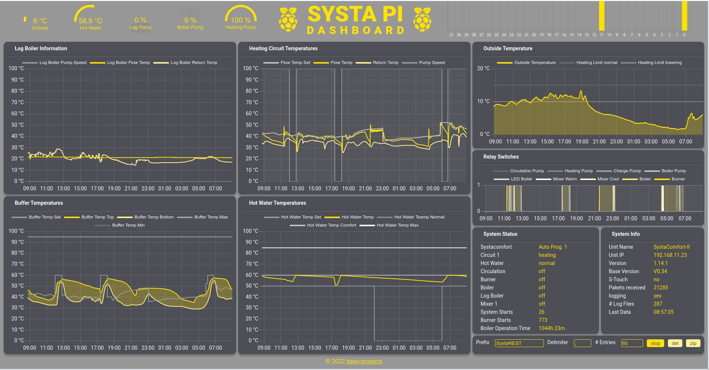
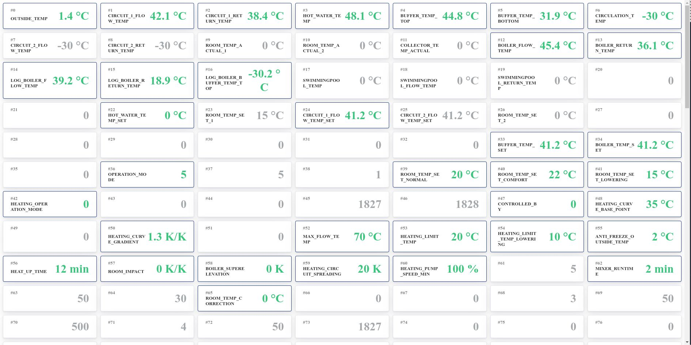
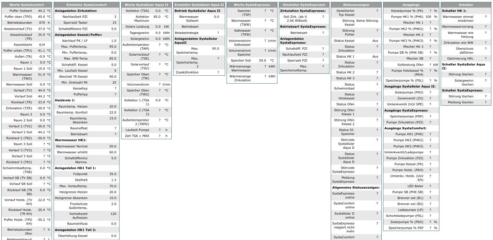

## The SystaREST API

If a command is called which should retrieve data from the SystaREST, but the communication is not running, `start` is automatically called, but the reply will be empty until the first data packet is received from the Paradigma SystaComfort. Data packets are sent every minute.

#### findsystacomfort

`GET` `/SystaREST/findsystacomfort`
[http://systapi:1337/SystaREST/findsystacomfort](http://systapi:1337/SystaREST/findsystacomfort)  
Searches the available interfaces for any attached SystaComfort unit.
```bash
curl "http://systapi:1337/SystaREST/findsystacomfort"
```

```json
{
    "SystaWebIP":"192.168.11.1",
    "SystaWebPort":22460,
    "DeviceTouchBcastIP":"192.168.11.255",
    "DeviceTouchBcastPort":8001,
    "deviceTouchInfoString":"SC2 1 192.168.11.23 255.255.255.0 192.168.11.1 SystaComfort-II\u00000 0809720001 0 V0.34 V1.00 2CBE9700BEE9",
    "unitIP":"192.168.11.23",
    "unitName":"SystaComfort-II",
    "unitId":"0809720001",
    "unitApp":8,
    "unitPlatform":9,
    "unitVersion":"1.14.1",
    "unitMajor":114,
    "unitMinor":1,
    "unitBaseVersion":"V0.34",
    "unitMac":"2CBE9700BEE9",
    "STouchAppSupported":false,
    "DeviceTouchPort":-1,
    "DeviceTouchPassword":"null"
}
```

#### start

`POST` `/SystaREST/start`  
start communication with the connected Paradigma SystaComfort

````bash
curl -X POST http://systapi:1337/SystaREST/start
````

#### stop

`POST` `/SystaREST/stop`  
stop communication with the connected Paradigma SystaComfort

````bash
curl -X POST http://systapi:1337/SystaREST/stop
````

#### servicestatus

`GET` `/SystaREST/servicestatus`  
[http://systapi:1337/SystaREST/servicestatus](http://systapi:1337/SystaREST/servicestatus)  
Returns the status of the SystaREST server
```bash
curl "http://systapi:1337/SystaREST/servicestatus"
```

```json
{
    "connected":true,
    "running":true,
    "lastDataReceivedAt":"Wed-30.06.21-00:00:19",
    "packetsReceived":234,
    "paradigmaListenerIP":"192.168.1.1",
    "paradigmaListenerPort":22460,
    "paradigmaIP":"192.168.1.23",
    "paradigmaPort":8002,
    "loggingData":false,
    "logFileSize":60,
    "logFilePrefix":"SystaREST",
    "logFileDelimiter":";",
    "logFileRootPath":"/home/pi/SystaRESTServer/bin/",
    "logFilesWritten":0,
    "logBufferedEntries":60
}
```

#### rawdata

`GET` `/SystaREST/rawdata`  
[http://systapi:1337/SystaREST/rawdata](http://systapi:1337/SystaREST/rawdata)  
Returns the raw data received from the Paradigma Systa Comfort with added timestamp information.

```bash
curl "http://systapi:1337/SystaREST/rawdata"
```

```json
{
    "timestamp":1623836832,
    "timestampString":"Wed-16.06.21-09:47:12",
    "rawData":[
        250,
        273,
        277,
        736,
        650,
        565,
        -300,
        -300,
        -300,
        0,
        0,
        0,
        332,
        ... (250 entries) ...
    ]
}
```

#### dashboard

`GET` `/SystaREST/dashboard`  
[http://systapi:1337/SystaREST/dashboard](http://systapi:1337/SystaREST/dashboard)  

Returns a React-based HTML dashboard that displays the received data for the last 24h. On the bottom right of the dashboard, you can start the logging of data (log/stop), delete the log files on the SystaPi (del) and download all saved logs as zip file (zip). Call this function from your browser, to see something like:



#### monitorrawdata

`GET` `/SystaREST/monitorrawdata`  
[http://systapi:1337/SystaREST/monitorrawdata](http://systapi:1337/SystaREST/monitorrawdata)  

Optional parameters:  

* `theme` default `SystaREST` other possible value `systaweb` 

Returns a React-based HTML page for monitoring of the raw data received from the Paradigma Systa Comfort. The content of the page should automatically refresh, but be aware that the SystaComfort sends its data only every minute, so parameter changes on the unit will be displayed with some lag. Call this function from your browser, to see something like:

| [http://systapi:1337/SystaREST/monitorrawdata](http://systapi:1337/SystaREST/monitorrawdata) |   | [http://systapi:1337/SystaREST/monitorrawdata?theme=systaweb](http://systapi:1337/SystaREST/monitorrawdata?theme=systaweb) |
|----------------------------------------------------------------------------------------------|---|----------------------------------------------------------------------------------------------------------------------------|
|     |   |                                  |

#### waterheater

`GET` `/SystaREST/waterheater`  
[http://systapi:1337/SystaREST/waterheater](http://systapi:1337/SystaREST/waterheater)  
Returns the information for a Home Assistant [Water Heater](https://developers.home-assistant.io/docs/core/entity/water-heater/)

```bash
curl "http://systapi:1337/SystaREST/waterheater"
```

```json
{
    "min_temp":40.0,
    "max_temp":65.0,
    "current_temperature":71.0,
    "target_temperature":0.0,
    "target_temperature_high":85.0,
    "target_temperature_low":0.0,
    "temperature_unit":"TEMP_CELSIUS",
    "current_operation":"locked",
    "operation_list":[
        "off",
        "normal",
        "comfort",
        "locked"
    ],
    "supported_features":[
    ],
    "is_away_mode_on":false,
    "timestamp":1623675405,
    "timestampString":"Mon-14.06.21-12:56:45"
}
```

#### status

`GET` `/SystaREST/status`  
[http://systapi:1337/SystaREST/status](http://systapi:1337/SystaREST/status)  
Returns all known fields from the received data.
```bash
curl "http://systapi:1337/SystaREST/status"
```

```json
{
    "outsideTemp":7.9,
    "operationMode":0,
    "operationModeName":"Auto Prog. 1",
    "circuit1FlowTemp":42.9,
    "circuit1ReturnTemp":29.8,
    "circuit1FlowTempSet":44.2,
    "circuit1LeadTime":0,
    "hotWaterTemp":59.3,
    "hotWaterTempSet":50.0,
    "hotWaterTempNormal":50.0,
    "hotWaterTempComfort":60.0,
    "hotWaterTempMax":85.0,
    "hotWaterOperationMode":1,
    "hotWaterOperationModeName":"normal",
    "hotWaterHysteresis":5.0,
    "bufferTempTop":54.6,
    "bufferTempBottom":34.0,
    "bufferTempSet":44.2,
    "logBoilerFlowTemp":21.3,
    "logBoilerReturnTemp":17.9,
    "logBoilerBufferTempTop":-30.2,
    "logBoilerBufferTempMin":30.0,
    "logBoilerTempMin":65.0,
    "logBoilerSpreadingMin":100.0,
    "logBoilerPumpSpeedMin":60,
    "logBoilerPumpSpeedActual":0,
    "logBoilerSettings":19,
    "boilerOperationMode":0,
    "boilerOperationModeName":"off",
    "boilerFlowTemp":37.6,
    "boilerReturnTemp":37.6,
    "boilerTempSet":0.0,
    "boilerSuperelevation":0,
    "boilerHysteresis":5.0,
    "boilerOperationTime":5,
    "boilerShutdownTemp":40.0,
    "boilerPumpSpeedMin":25,
    "circulationTemp":-30.0,
    "circulationPumpIsOn":false,
    "circulationPumpOverrun":3,
    "circulationLockoutTimePushButton":15,
    "circulationHysteresis":5.0,
    "circuit2FlowTemp":-30.0,
    "circuit2ReturnTemp":-30.0,
    "circuit2FlowTempSet":44.2,
    "roomTempActual1":0.0,
    "roomTempSet1":20.0,
    "roomTempActual2":0.0,
    "roomTempSet2":0.0,
    "roomTempSetNormal":20.0,
    "roomTempSetComfort":22.0,
    "roomTempSetLowering":15.0,
    "roomImpact":0.0,
    "roomTempCorrection":0.0,
    "collectorTempActual":0.0,
    "swimmingpoolFlowTemp":0.0,
    "swimmingpoolFlowTeamp":0.0,
    "swimmingpoolReturnTemp":0.0,
    "heatingOperationMode":1,
    "heatingOperationModeName":"normal",
    "heatingCurveBasePoint":35.0,
    "heatingCurveGradient":1.3,
    "heatingLimitTemp":20.0,
    "heatingLimitTeampLowering":10.0,
    "heatingPumpSpeedActual":100,
    "heatingPumpOverrun":10,
    "heatingPumpIsOn":true,
    "heatingCircuitSpreading":20.0,
    "heatingPumpSpeedMin":100,
    "controlledBy":0,
    "controlMethodName":"external temp",
    "maxFlowTemp":70.0,
    "antiFreezeOutsideTemp":2.0,
    "heatUpTime":120,
    "mixerRuntime":2,
    "mixer1IsOnWarm":false,
    "mixer1IsOnCool":false,
    "mixer1State":0,
    "mixer1StateName":"off",
    "underfloorHeatingBasePoint":35.0,
    "underfloorHeatingGradient":1.3,
    "bufferTempMax":95.0,
    "bufferTempMin":0.0,
    "adjustRoomTempBy":0.0,
    "solarPowerActual":0.0,
    "solarGainDay":0.0,
    "solarGainTotal":0.0,
    "relay":2049,
    "chargePumpIsOn":false,
    "boilerIsOn":false,
    "burnerIsOn":false,
    "systemNumberOfStarts":26,
    "burnerNumberOfStarts":394,
    "boilerOperationTimeHours":234,
    "boilerOperationTimeMinutes":58,
    "unknowRelayState1IsOn":false,
    "unknowRelayState2IsOn":true,
    "unknowRelayState5IsOn":true,
    "error":65535,
    "operationModeX":0,
    "heatingOperationModeX":1,
    "timestamp":1640345997,
    "timestampString":"Fri-24.12.21-11:39:57"
}
```

#### enablelogging

`PUT` `/SystaREST/enablelogging`  
enables the logging of each received data element to a delimited log file. To reduce the number of file writes, this function stores `entriesPerFile` data segments in memory and then writes them into a single file. If logging is not enabled, SystaREST still stores the last `entriesPerFile` data segments in memory and saves them to the disc as soon as logging gets enabled. This feature shall help to implement triggers for value changes of interest, by also saving data that has been received before the interesting event happened.  

Optional parameters:  

* `filePrefix` default `SystaREST`
* `logEntryDelimiter` default `;`
* `entriesPerFile` default `60

```bash
curl -X PUT "http://systapi:1337/SystaREST/enablelogging?filePrefix=SystaREST&logEntryDelimiter=;&entriesPerFile=1337"
```

#### disablelogging

`PUT` `/SystaREST/disablelogging`  
stop the logging of received data packets. This writes all currently stored data segments to a file and stops the writing to disc.

```bash
curl -X PUT http://systapi:1337/SystaREST/disblelogging
```
