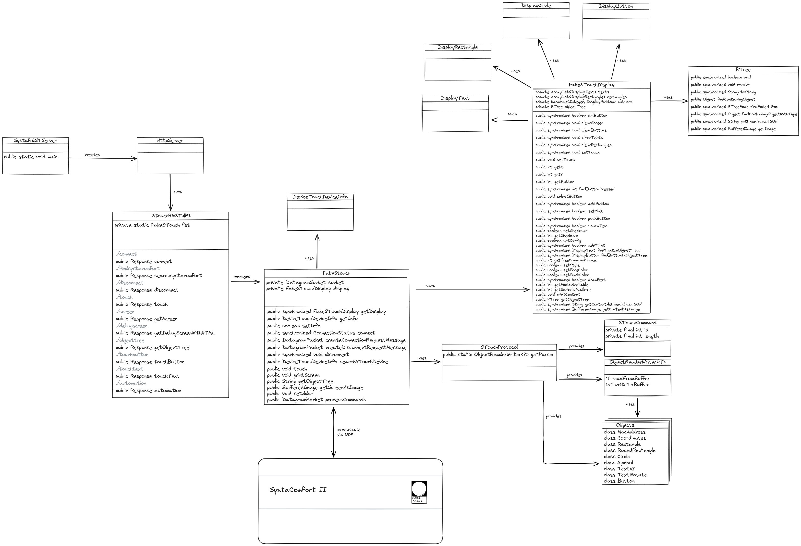

<div align="center">

</div>

<sup>\[[Back to README](..\README.md)\]</sup>

Welcome future contributor, this document shall give you an overview of the Java services developed for SystaPi and give you a starting point for extending their functionality.  
The project is set up without any sophisticated build pipeline, you just need to run the `build.sh` for compiling the code.

# Contents
- [FakeSystaWeb](#fakesystaweb)
  - [1. FakeSystaWeb.java](#1-fakesystawebjava)
  - [2. SystaIndex.java](#2-systaindexjava)
  - [3. How to Add a New Attribute to FakeSystaWeb](#3-how-to-add-a-new-attribute-to-fakesystaweb)
    - [Step 1: Add a New Constant in `SystaIndex.java`](#step-1-add-a-new-constant-in-systaindexjava)
    - [Step 2: Update Data Structures and Methods in `FakeSystaWeb.java`](#step-2-update-data-structures-and-methods-in-fakesystawebjava)
      - [A. No changes needed for `intData` (usually)](#a-no-changes-needed-for-intdata-usually)
      - [B. Update `getParadigmaStatus()` (or a relevant getter)](#b-update-getparadigmastatus-or-a-relevant-getter)
    - [Summary of `FakeSystaWeb.java` Changes:](#summary-of-fakesystawebjava-changes)
- [FakeSTouch](#fakestouch)
  - [1. `FakeSTouch.java`](#1-fakestouchjava)
  - [2. `STouchProtocol.java` and `ObjectReaderWriter`s](#2-stouchprotocoljava-and-objectreaderwriters)
  - [3. `FakeSTouchDisplay.java`](#3-fakestouchdisplayjava)
  - [4. How to Add a New UI Element](#4-how-to-add-a-new-ui-element)
    - [Step 1: Define its Base Structure as an Object in `STouchProtocol.java`](#step-1-define-its-base-structure-as-an-object-in-stouchprotocoljava)
    - [Step 2: Create an `ObjectReaderWriter` for the New Object in `STouchProtocol.java`](#step-2-create-an-objectreaderwriter-for-the-new-object-in-stouchprotocoljava)
    - [Step 3: Create a Display Object in `FakeSTouchDisplay.java`](#step-3-create-a-display-object-in-fakestouchdisplayjava)
    - [Step 4: Handle the Command in `FakeSTouch.java`](#step-4-handle-the-command-in-fakestouchjava)
  - [5. How to Implement a New Command](#5-how-to-implement-a-new-command)
    - [Step 1: Define the Command in `STouchProtocol.java`](#step-1-define-the-command-in-stouchprotocoljava)
    - [Step 2: Implement Handling in `processCommands` of `FakeSTouch.java`](#step-2-implement-handling-in-processcommands-of-fakestouchjava)

# FakeSystaWeb
<sup>\[[Back to Contents](#contents)\]</sup>

<div align="center">

</div>

## 1. FakeSystaWeb.java
<sup>\[[Back to Contents](#contents)\]</sup>

`FakeSystaWeb.java` serves as a mock implementation of the Paradigma SystaWeb service. Its primary purpose is to emulate the communication of the SystaWeb service and read status attributes from a Paradigma SystaComfort heating control system.

**Key Functionalities:**

*   **UDP Communication:** Communication is done via UDP. `FakeSystaWeb.java` opens a `DatagramSocket` to listen for and send UDP packets, mimicking the communication protocol used by the SystaComfort system.
*   **Data Reception and Processing:** The received packets contain various sensor readings and status information from the heating system. Some attributes have been identified using reverse engineering, but there are still a lot of unknown attributes contained in the data.
*   **Data Storage:** The received data is stored in internal data structures, primarily an array of `Integer` arrays (`intData`), using a ring buffer mechanism to keep a short history of received data packets.
*   **Data Access:** Methods for accessing the stored data (e.g., `getData()`, `getParadigmaStatus()`, `getWaterHeaterStatus()`) convert the `Integer`s to the actual values of the associated attributes. This allows other parts of the application (like `SystaRESTAPI`) to retrieve heating system information.
*   **Replying to SystaComfort:** For each received data packet, a reply packet is sent back to the SystaComfort unit to maintain the communication link. 
*   **Data Logging:** It includes functionality to log raw received data and processed integer data to files using the `DataLogger` class. This is useful for debugging and analysis.
*   **Status Reporting:** It provides a status of its own operation, including connection state, data packets received, and logger status.
*   **Device Discovery:** It can initiate a search for SystaComfort devices on the network using `DeviceTouchSearch.search()`.

Esentially, `FakeSystaWeb` acts as a bridge for the heating system information, abstracting the low-level UDP communication and data parsing for other components, like `SystaRESTAPI.java`.

## 2. SystaIndex.java
<sup>\[[Back to Contents](#contents)\]</sup>

`SystaIndex.java` is a crucial helper class that defines constants representing the indices of known data points within the data packets received from the SystaComfort system.

**Key Roles:**

*   **Data Mapping:** The SystaComfort unit sends data as arrays of numerical values. `SystaIndex.java` provides named constants (e.g., `OUTSIDE_TEMP`, `HOT_WATER_TEMP`, `BOILER_FLOW_TEMP_SET`) that map to specific positions (indices) in these arrays.
*   **Readability and Maintainability:** Instead of using raw numerical indices (e.g., `intData[0]`, `intData[22]`) directly in `FakeSystaWeb.java` or other data processing classes, these constants make the code much more readable and easier to understand. For example, `intData[i][SystaIndex.HOT_WATER_TEMP]` is clearer than `intData[i][3]`.
*   **Documentation:** The comments within `SystaIndex.java` include descriptions of what each data point represents, serving as inline documentation for the known data fields.

`SystaIndex.java` is your starting point to add new attributes.

## 3. How to Add a New Attribute to FakeSystaWeb
<sup>\[[Back to Contents](#contents)\]</sup>

Adding a new attribute that `FakeSystaWeb` can read and expose involves changes in both `SystaIndex.java` and `FakeSystaWeb.java`. Let's assume you want to add a new attribute called "Solar Pump Speed" which is an integer value.

### Step 1: Add a New Constant in `SystaIndex.java`

First, you need to identify the index at which the new attribute's data will arrive in the UDP packet. Let's say this new attribute "Solar Pump Speed" is found at index `250`.

For this you need to edit `SystaIndex.java` and add a new constant:

```java
// SystaIndex.java

public final class SystaIndex {

    // ... existing constants ...

    /**
     * (Pumpengeschwindigkeit Solarkreispumpe)
     * Actual speed of the solar circuit pump in percent.
     */
    final static int SOLAR_PUMP_SPEED_ACTUAL = 250; // Assuming this is the correct index

    // ... other constants ...
}
```

*   **Add a descriptive comment:** Explain what the attribute represents, its units, and any other relevant information.

### Step 2: Update Data Structures and Methods in `FakeSystaWeb.java`

Now, you need to make `FakeSystaWeb.java` aware of this new attribute so it can be read and exposed, typically through the `SystaStatus` object.

#### A. No changes needed for `intData` (usually)

The SystaComfort is sending a sequence of packets, that have a running number which we use as type. Packets with type `0` are used to initiate data transmission, but don't hold data. Packets with type `1` to `4` hold data and are processed by `FakeSystaWeb.java`.
The `intData` array is defined as `Integer[RING_BUFFER_SIZE][MAX_NUMBER_ENTRIES*MAX_NUMBER_DATA_PACKETS]`.
`MAX_NUMBER_ENTRIES` is `256` and `MAX_NUMBER_DATA_PACKETS` is `4`. This means `intData` can hold `256 * 4 = 1024` integer values. If your SystaComfort sends larger data packets, or more types of data packets, you need to make changes to the handling logic for `intData`

If your new index (e.g., `250`) is within the range `0` to `(MAX_NUMBER_ENTRIES * MAX_NUMBER_DATA_PACKETS) - 1`, and the data packet type (`DATA1`, `DATA2`, `DATA3`, `DATA4`) that carries this new attribute is already being processed correctly by `processDataType1` through `processDataType4` methods, then `intData[writeIndex][SystaIndex.SOLAR_PUMP_SPEED_ACTUAL]` will automatically be populated when the corresponding data packet arrives.

The methods `processDataType1` to `processDataType4` handle different segments of the total data array:
*   `processDataType1`: indices `0` to `MAX_NUMBER_ENTRIES - 1`
*   `processDataType2`: indices `MAX_NUMBER_ENTRIES` to `2*MAX_NUMBER_ENTRIES - 1`
*   `processDataType3`: indices `2*MAX_NUMBER_ENTRIES` to `3*MAX_NUMBER_ENTRIES - 1`
*   `processDataType4`: indices `3*MAX_NUMBER_ENTRIES` to `4*MAX_NUMBER_ENTRIES - 1`

If our `SOLAR_PUMP_SPEED_ACTUAL` is at index `250`, it falls into the range handled by `processDataType1` (assuming `MAX_NUMBER_ENTRIES` is 256 or more). The line `intData[writeIndex][offset + (data.position() - 24) / 4] = data.getInt();` in `processDataPacket` will store the value.

#### B. Update `getParadigmaStatus()` (or a relevant getter)

To make the new attribute accessible, you'll typically add it to the `SystaStatus` class and populate it in the `getParadigmaStatus()` method within `FakeSystaWeb.java`.

1.  **Modify `SystaStatus.java`:**
    You would first add a field for `solarPumpSpeedActual` to `SystaStatus.java`:
    ```java
    // In SystaStatus.java
    public double solarPumpSpeedActual; // Or int, depending on the data type and scaling
    ```

2.  **Update `getParadigmaStatus()` in `FakeSystaWeb.java`:**
    ```java
    // FakeSystaWeb.java

    public SystaStatus getParadigmaStatus() {
        SystaStatus status = new SystaStatus();
        int i = readIndex; // save readIndex, so we do not read inconsistent data if it gets updated
        if (i < 0 || timestamp[i] <= 0) {
            return null;
        }
        // ... existing attribute assignments ...
        status.outsideTemp = intData[i][SystaIndex.OUTSIDE_TEMP] / 10.0;
        // ... many other attributes ...

        // Add the new attribute
        // Assuming the raw value is an integer representing percentage directly
        // or needs scaling similar to other temperature values (e.g., / 10.0)
        // For pump speed in %, direct assignment or simple scaling might be appropriate.
        // Let's assume it's a direct percentage value.
        if (intData[i][SystaIndex.SOLAR_PUMP_SPEED_ACTUAL] != null) { // Good practice to check for null
            status.solarPumpSpeedActual = intData[i][SystaIndex.SOLAR_PUMP_SPEED_ACTUAL]; // Or apply scaling if needed, e.g., * 5 for some pump speeds
        } else {
            // Handle cases where data might not be available, e.g. set to a default or error indicator
            status.solarPumpSpeedActual = -1; // Or Double.NaN;
        }


        // ... rest of the assignments ...
        status.timestamp = timestamp[i];
        status.timestampString = getFormattedTimeString(timestamp[readIndex]);
        return status;
    }
    ```

    *   **Scaling/Units:** Pay attention to how the raw integer data needs to be converted to the desired unit. For temperatures, it's often divided by `10.0`. For percentages (like pump speed), it might be direct, or multiplied by a factor (e.g., `* 5` as seen for `HEATING_PUMP_SPEED_ACTUAL`). This depends on how the SystaComfort device sends the data. Check `SystaIndex.java` comments or other documentation.
    *   **Null Check:** While `intData` is initialized with `0`, if a particular data packet containing the new index hasn't arrived yet or if there are issues, the specific entry `intData[i][SystaIndex.SOLAR_PUMP_SPEED_ACTUAL]` might conceptually be "not yet set" for the current `readIndex`. While `Integer` objects can be `null`, the array initialization with `Arrays.fill(data, 0)` means they will be `0` initially. However, being explicit about how you handle potentially missing or default data is good. If the index is out of bounds of a received packet, it would retain its previous value (or initial `0`).

### Summary of `FakeSystaWeb.java` Changes:

*   Usually, no direct changes to `intData` declaration if the new index is within its existing bounds and the packet type is handled.
*   The primary change is in the getter method (e.g., `getParadigmaStatus()`) to retrieve the data using the new `SystaIndex` constant, apply any necessary scaling, and assign it to the corresponding field in the status object (e.g., `SystaStatus`).
*   Remember to update the status class itself (e.g., `SystaStatus.java`) to include a field for the new attribute.

By following these steps, you can extend `FakeSystaWeb` to support new attributes from the Paradigma heating system.

# FakeSTouch
<sup>\[[Back to Contents](#contents)\]</sup>

<div align="center">

</div>

## 1. `FakeSTouch.java`
<sup>\[[Back to Contents](#contents)\]</sup>

`FakeSTouch.java` simulates the S-Touch App or control unit. The S-Touch App is actually just acting as a graphics canvas with a touch interface. The SystaComfort unit is drawig UI elements onto the canvas and managing all the application logic. `FakeSTouch` emulates the drawing on the canvas and the generation of touch events for user interaction.

**Key Functionalities:**

*   **UDP Communication:** Establishes and manages a UDP socket connection with a Paradigma SystaComfort unit. The communication involves sending touch events and receiving display updates.
*   **Connection Management:** Handles the connection lifecycle, including connecting to a device (discovered via `DeviceTouchSearch` or specified) and disconnecting.
*   **Command Processing:** Receives command packets from the SystaComfort unit. These commands are instructions on what to display (e.g., draw text, rectangles, buttons) or are system-level operations for managing the graphical device.
*   **Display Emulation:** It uses `FakeSTouchDisplay.java` to maintain the representation of what should be shown on the S-Touch screen.
*   **Event Simulation:** Allows simulation of touch events (`touch(x, y)`) which are then processed to determine if a button was pressed on the virtual display.
*   **Reply Generation:** Sends acknowledgment or reply packets back to the SystaComfort unit in response to received commands, including information about simulated touch events.
*   **Asynchronous Listening:** Uses an `ExecutorService` to listen for incoming UDP packets asynchronously.

Essentially, `FakeSTouch` acts as a virtual S-Touch panel, allowing automated interaction with the heating system's control interface.

## 2. `STouchProtocol.java` and `ObjectReaderWriter`s
<sup>\[[Back to Contents](#contents)\]</sup>

`STouchProtocol.java` is central to defining and managing the communication protocol between the S-Touch (or `FakeSTouch`) and the SystaComfort unit.

**`STouchProtocol.java`:**

*   **Command Definitions (`STouchCommand` enum):** This enum lists all known commands that can be sent or received. Each command is identified in the protocol data by an ID (byte value) and has a defined or variable length. Examples include `DISPLAY_PRINTXY` (print text at coordinates), `DISPLAY_SETBUTTON` (define a button), `SYSTEM_GETSYSTEM` (request system information).
*   **Data Type Definitions:** While not explicitly an command, `STouchCommand` also includes entries like `TYPE_BYTE`, `TYPE_SHORT_INTEGER`, `TYPE_INTEGER` which are used internally by the `ObjectReaderWriter`s to specify how basic data types are read and written. The ID's of these pseudo commands need to be outside of the ID range used by the S-Touch protocol.
*   **Object Definitions (Inner Classes):** Defines Plain Old Java Objects (POJOs) that represent the data structures associated with commands. For example, `Coordinates` (for X,Y positions), `Rectangle` (for drawing rectangles), `Button` (for button properties), `TextXY` (for text with coordinates).
*   **`ObjectReaderWriter` Interface and Implementations:**
    *   **Interface:** The `ObjectReaderWriter<T>` interface defines two methods: `readFromBuffer(ByteBuffer buffer)` and `writeToBuffer(ByteBuffer buffer, T object)`.
    *   **Implementations:** For many `STouchCommand`s and data types, there's a corresponding class implementing `ObjectReaderWriter`. These classes know how to serialize a Java object (like `Coordinates`) into a sequence of bytes in a `ByteBuffer` according to the S-Touch protocol, and how to deserialize bytes from a `ByteBuffer` back into the corresponding Java object.
    *   **Examples:** `CoordinatesReaderWriter`, `RectangleReaderWriter`, `TextXYReaderWriter`, `ByteReaderWriter`, `ShortIntegerReaderWriter`.
*   **Centralized Parsing and Serialization Logic:** The static methods `STouchProtocol.read(STouchCommand cmd, ByteBuffer buffer)` and `STouchProtocol.write(STouchCommand cmd, ByteBuffer buffer, T object)` use a map of `ObjectReaderWriter`s to delegate the actual reading and writing based on the command type. This keeps the main logic in `FakeSTouch.java` cleaner.
*   **Variable Length Command Handling:** The `STouchCommand.length(ByteBuffer buffer)` method, especially for commands like `DISPLAY_PRINT`, can determine the command's length by looking ahead in the buffer (e.g., for a null terminator in a string).

**`ObjectReaderWriter`s:**

`ObjectReaderWriter`s are the workhorses for translating between the Java objects used within `FakeSTouch` and the byte streams required by the S-Touch UDP protocol. Each reader/writer is specialized for a particular data structure or type (e.g., a `Button`, a `Color`, a short integer). They ensure that data is packed into and unpacked from `ByteBuffer`s correctly, respecting byte order (Little Endian in this protocol) and data field sizes.

`STouchProtocol.java` and its `ObjectReaderWriter`s, simplify the command processing logic in `FakeSTouch.java` by encapsulating the handle byte-level manipulation. This should make it relatively easy to add support of new commands.

## 3. `FakeSTouchDisplay.java`
<sup>\[[Back to Contents](#contents)\]</sup>

`FakeSTouchDisplay.java` is responsible for maintaining the state of the simulated S-Touch screen. It keeps track of all the UI elements that are supposed to be displayed, their properties, and their positions. The behaviour of the screen is guessed from the protocol data by analyzing the data packets and observing the elements shown in the S-Touch app and might be wrong in some situations.

**Key Functionalities:**

*   **UI Element Storage:** Stores collections of display elements, such as:
    *   `texts` (ArrayList of `DisplayText` objects)
    *   `rectangles` (ArrayList of `DisplayRectangle` objects)
    *   `buttons` (HashMap of `DisplayButton` objects, keyed by ID)
*   **`RTree` for Spatial Indexing:** It uses an `RTree` (`objectTree`) to store UI elements. The R-tree is a spatial data structure that allows for efficient querying of objects based on their location (e.g., "find which button was pressed at coordinates X,Y"). This is crucial for hit detection in a touch interface.
*   **Rendering State:** Manages current rendering attributes like `foregroundColor`, `backgroundColor`, and `style`. These affect how subsequent elements are "drawn."
*   **Screen Manipulation Methods:** Provides methods that are called by `FakeSTouch.java` when processing display commands from the SystaComfort unit. Examples:
    *   `addText(TextXY textXY)`: Adds a text element.
    *   `drawRect(Rectangle rectangle)`: Adds a rectangle.
    *   `addButton(Button b)`: Adds a button.
    *   `delButton(int id)`: Deletes a button (or clears the screen if id is -1).
    *   `clearScreen()`: Removes all elements.
    *   `setStyle(int style)`, `setForeColor(Color color)`, `setBackColor(Color color)`: Update rendering attributes.
*   **Touch Event Handling Support:**
    *   `setTouch(int id, int x, int y)`: Records a simulated touch, often highlighting the touched button.
    *   `findButtonPressed(int x, int y)`: Uses the `RTree` to determine which button (if any) exists at the given coordinates.
*   **Checksum and Configuration:** Manages a `checksum` and `config` related to the display state or resource versioning, as expected by the S-Touch protocol.
*   **Output/Debugging:**
    *   `printContent()`: Prints a textual representation of the display content to the console.
    *   `getContentAsImage()`: Renders the current display state into a `BufferedImage`, useful for visual inspection.
    *   `getObjectTree()`: Provides access to the R-tree for advanced inspection.

`FakeSTouchDisplay` provides the "virtual screen" onto which `FakeSTouch` renders the UI elements instructed by the heating system. It's essential for understanding the current UI state and for correctly simulating user interactions.

## 4. How to Add a New UI Element
<sup>\[[Back to Contents](#contents)\]</sup>

Let's say we want to add a new UI element: a "Progress Bar". This progress bar will have an ID, coordinates for its top-left corner, a width, a height, and a progress percentage (0-100).

### Step 1: Define its Base Structure as an Object in `STouchProtocol.java`

Edit `STouchProtocol.java`.

First, create a new inner class to represent the ProgressBar's data:

```java
// STouchProtocol.java

// ... existing inner classes (Coordinates, Rectangle, etc.) ...

public static class ProgressBar {
    public final int id;
    public final int x;
    public final int y;
    public final int width;
    public final int height;
    public final int progress; // 0-100

    public ProgressBar(int id, int x, int y, int width, int height, int progress) {
        this.id = id;
        this.x = x;
        this.y = y;
        this.width = width;
        this.height = height;
        this.progress = progress;
    }

    @Override
    public String toString() {
        return "ProgressBar { \"id\": " + id + ", \"x\": " + x + ", \"y\": " + y + 
               ", \"width\": " + width + ", \"height\": " + height + 
               ", \"progress\": " + progress + " }";
    }
}
```

Next, add a new command to the `STouchCommand` enum. Let's assume the command ID is `147`:

```java
// STouchProtocol.java -> enum STouchCommand

public static enum STouchCommand {
    // ... existing commands ...
    DISPLAY_SETTEMPOFFSETS(146, 4),
    DISPLAY_SETPROGRESSBAR(147, 10), // ID (byte), X(short), Y(short), Width(short), Height(short), Progress(byte) = 1+2+2+2+2+1 = 10 bytes.
    SYSTEM_GETSYSTEM(240, 0),
    // ... rest of the commands ...
}
```
The length is calculated from the bytes used for its representation in the command packets: `ID (byte, 1 byte)`, `X (short, 2 bytes)`, `Y (short, 2 bytes)`, `Width (short, 2 bytes)`, `Height (short, 2 bytes)`, `Progress (byte, 1 byte)`. So, parameter length is `1+2+2+2+2+1 = 10`.

### Step 2: Create an `ObjectReaderWriter` for the New Object in `STouchProtocol.java`

Now, create the `ProgressBarReaderWriter`:

```java
// STouchProtocol.java

// ... existing ObjectReaderWriters ...

private static class ProgressBarReaderWriter implements ObjectReaderWriter<ProgressBar> {
    private final ByteReaderWriter byteReaderWriter = new ByteReaderWriter();
    private final ShortIntegerReaderWriter shortReaderWriter = new ShortIntegerReaderWriter();

    @Override
    public ProgressBar readFromBuffer(ByteBuffer buffer) {
        if (buffer.remaining() < 10) { // 1(id) + 2(x) + 2(y) + 2(width) + 2(height) + 1(progress)
            throw new BufferUnderflowException();
        }
        int id = byteReaderWriter.readFromBuffer(buffer);
        int x = shortReaderWriter.readFromBuffer(buffer);
        int y = shortReaderWriter.readFromBuffer(buffer);
        int width = shortReaderWriter.readFromBuffer(buffer);
        int height = shortReaderWriter.readFromBuffer(buffer);
        int progress = byteReaderWriter.readFromBuffer(buffer);
        return new ProgressBar(id, x, y, width, height, progress);
    }

    @Override
    public int writeToBuffer(ByteBuffer buffer, ProgressBar progressBar) {
        if (buffer.remaining() < 10) { // As per current length definition
            throw new BufferOverflowException();
        }
        byteReaderWriter.writeToBuffer(buffer, progressBar.id);
        shortReaderWriter.writeToBuffer(buffer, progressBar.x);
        shortReaderWriter.writeToBuffer(buffer, progressBar.y);
        shortReaderWriter.writeToBuffer(buffer, progressBar.width);
        shortReaderWriter.writeToBuffer(buffer, progressBar.height);
        byteReaderWriter.writeToBuffer(buffer, progressBar.progress);
        return 10;
    }
}
```

Register the reader/writer in the `static` block:
```java
// STouchProtocol.java -> static block

static {
    // ... existing registrations ...
    readerWriters.put(STouchCommand.DISPLAY_SETTEMPOFFSETS, new CoordinatesReaderWriter());
    readerWriters.put(STouchCommand.DISPLAY_SETPROGRESSBAR, new ProgressBarReaderWriter()); // Add this line
    // ...
}
```

### Step 3: Create a Display Object in `FakeSTouchDisplay.java`

Edit `FakeSTouchDisplay.java`.

Define a `DisplayProgressBar` class:
```java
// FakeSTouchDisplay.java

// ... existing inner Display classes (DisplayButton, DisplayText, etc.) ...

public class DisplayProgressBar {
    STouchProtocol.ProgressBar progressBar;
    Color barColor; // Optional: specific color for the progress bar fill

    public DisplayProgressBar(STouchProtocol.ProgressBar progressBar, Color barColor) {
        this.progressBar = progressBar;
        this.barColor = barColor; // Could be derived from foregroundColor too
    }

    @Override
    public String toString() {
        return "ProgressBar ID: " + progressBar.id + " at (" + progressBar.x + "," + progressBar.y + ") " +
               progressBar.width + "x" + progressBar.height + " Progress: " + progressBar.progress + "%";
    }
    // Add hashCode and equals if storing in HashSets or using as HashMap keys
}
```

Add a list to store these progress bars and a method to add them:
```java
// FakeSTouchDisplay.java

public class FakeSTouchDisplay {
    // ... existing fields (texts, rectangles, buttons, objectTree) ...
    private HashMap<Integer, DisplayProgressBar> progressBars = new HashMap<>();
    // ...

    // Method to add/update a progress bar
    public synchronized boolean setProgressBar(STouchProtocol.ProgressBar pbData) {

        // Remove existing if it's an update to a single progress bar
        if (!progressBars.isEmpty()) {
            DisplayProgressBar oldPb = progressBars.get(pbData.id); // Assuming single for now
            getObjectTree().remove(new RTreeNode(oldPb, oldPb.progressBar.x, oldPb.progressBar.y,
                                   oldPb.progressBar.x + oldPb.progressBar.width, 
                                   oldPb.progressBar.y + oldPb.progressBar.height, null, null, null));
            progressBars.clear();
        }
        
        DisplayProgressBar newPb = new DisplayProgressBar(pbData, foregroundColor); // Use current foreground color
        progressBars.put(pbData.id, newPb);
        
        return getObjectTree().add(new RTreeNode(newPb, pbData.x, pbData.y, 
                                   pbData.x + pbData.width, pbData.y + pbData.height, 
                                   foregroundColor, backgroundColor, null));
    }

    // ... existing methods ...
    public synchronized void clearScreen() {
        clearTexts();
        clearButtons();
        clearRectangles();
        clearProgressBars(); // Add this
        objectTree = new RTree();
    }

    public synchronized void clearProgressBars() {
        for (DisplayProgressBar pb : progressBars) {
            getObjectTree().remove(new RTreeNode(pb, pb.progressBar.x, pb.progressBar.y, 
                                   pb.progressBar.x + pb.progressBar.width, 
                                   pb.progressBar.y + pb.progressBar.height, null, null, null));
        }
        progressBars.clear();
    }
}
```

### Step 4: Handle the Command in `FakeSTouch.java`

You would then need to make `FakeSTouch.java` call `display.setProgressBar()` when it processes the `DISPLAY_SETPROGRESSBAR` command.

In `FakeSTouch.java`, within the `initializeDisplayActions()` method:
```java
// FakeSTouch.java -> initializeDisplayActions()
// ...
displayMethods.put(STouchCommand.DISPLAY_SETTEMPOFFSETS, parameters -> true); // Example of existing
displayMethods.put(STouchCommand.DISPLAY_SETPROGRESSBAR, 
    parameters -> this.getDisplay().setProgressBar((STouchProtocol.ProgressBar) parameters));
// ...
```
And ensure `processCommands` correctly calls this.

This completes the steps for defining and displaying a new UI element. Rendering it in `getObjectTree().getImage()` would require adding drawing logic to `RTreeNode` or a similar place if you want visual output beyond textual representation.

## 5. How to Implement a New Command
<sup>\[[Back to Contents](#contents)\]</sup>

Let's say we want to implement a new command `SYSTEM_RESET_STATISTICS` which takes no parameters.

### Step 1: Define the Command in `STouchProtocol.java`

Edit `STouchProtocol.java`.

Add the new command to the `STouchCommand` enum. Assume it's ID is `253`:

```java
// STouchProtocol.java -> enum STouchCommand

public static enum STouchCommand {
    // ... existing commands ...
    SYSTEM_ACTIVATEAPP(252, 0),
    SYSTEM_RESET_STATISTICS(253, 0), // New command, 0 parameters
    // ...
    TYPE_BYTE(1337, 1),
    // ...
}
```
Since it has no parameters, its length is `0`. No new `ObjectReaderWriter` is needed if there are no parameters. If it had parameters, you'd define an object and a reader/writer as in the UI element example.

### Step 2: Implement Handling in `processCommands` of `FakeSTouch.java`

Edit `FakeSTouch.java`.

Modify the `processCommands` method to handle this new command. Typically, system commands might not directly use the `displayMethods` map if they require unique reply logic or modify `FakeSTouch` state directly.

```java
// FakeSTouch.java -> processCommands method

public DatagramPacket processCommands(DatagramPacket packet) {
    // ... initial setup ...
    // ... loop over all received commands ...
    while (true) {
        // ...
        if (rcvBuffer.position() < rcvLen) {
            // ...
            STouchCommand cmd = (STouchCommand) STouchProtocol.read(STouchCommand.TYPE_COMMAND, rcvBuffer);
            if (cmd != null) {
                int cmdLen = cmd.length(rcvBuffer);
                if (cmdLen >= 0) {
                    if (isCommandEnabled(cmd)) {
                        printDebugInfo("process cmd: " + cmd.name());
                        Object parameters = null;
                        switch (cmd) {
                            // ... existing cases ...
                            case SYSTEM_SETCONFIG:
                                // ...
                                break;

                            case SYSTEM_RESET_STATISTICS: // Our new command
                                printDebugInfo(cmd.name());
                                // Perform the action for resetting statistics.
                                // This might involve calling a method on FakeSTouch, FakeSystaWeb,
                                // or another component. For this example, let's just print a message.
                                System.out.println("[FakeSTouch] Received SYSTEM_RESET_STATISTICS. Statistics would be reset here.");
                                
                                // This command might send a simple acknowledgment.
                                // If it needs a specific reply structure, build it here.
                                // For many system commands, the reply might be a generic OK/ERROR,
                                // or a specific response structure.
                                // If it's a simple ACK and fits the standard OK replyType:
                                if (replyType == ReplyType.OK) { // Ensure we are still in an OK state
                                   // If the command expects a specific response in the reply packet,
                                   // add it to replyBuffer here.
                                   // For example:
                                   // STouchProtocol.write(STouchCommand.TYPE_COMMAND, replyBuffer, STouchCommand.SYSTEM_RESET_STATISTICS);
                                   // STouchProtocol.write(STouchCommand.TYPE_BYTE, replyBuffer, 0); // Status code 0 for success
                                }
                                break;

                            default:
                                // ... existing default handling ...
                                Function<Object, Boolean> processor = displayMethods.get(cmd);
                                if (processor != null) {
                                   // ...
                                } else {
                                   printDebugInfo("Unknown or unhandled display method type: " + cmd.name());
                                   // replyType = ReplyType.ERROR; // Or handle as appropriate
                                }
                                break;
                        }
                        // ...
                    } else {
                        // ... command not enabled ...
                    }
                } else {
                    replyType = ReplyType.ERROR; // cmdLen < 0 means error determining length
                }
            } else {
                 replyType = ReplyType.ERROR; // cmd is null (unknown command ID)
            }
        } else {
            // ... end of commands in packet ...
            break;
        }
    }
    // ... final reply packet assembly ...
    return replyPacket;
}
```

**Explanation of `processCommands` modification:**

1.  **Case for `SYSTEM_RESET_STATISTICS`:** A new `case` is added to the `switch (cmd)` statement.
2.  **Action Implementation:** Inside this case, you would put the Java code that actually performs the "reset statistics" operation. This might involve calling methods on other objects or services that `FakeSTouch` has access to.
3.  **Reply Handling:**
    *   The existing `processCommands` structure builds a reply packet. Simple commands might not need to add anything specific to the `replyBuffer` if the standard OK/Error status appended at the end of `processCommands` is sufficient.
    *   If `SYSTEM_RESET_STATISTICS` requires a unique success/failure code or specific data in its reply, you would use `STouchProtocol.write(...)` to add that to `replyBuffer` within this `case`. Often, a command might just need to ensure `replyType` remains `ReplyType.OK` if successful.
    *   If the command is purely an action with no specific data returned in the reply beyond the standard acknowledgment, no special `STouchProtocol.write` calls might be needed in its `case` block, relying on the generic reply assembly.

By following these steps, you can define new commands and integrate their handling into the `FakeSTouch` simulation. Remember to thoroughly test any new commands or UI elements.
"""

<sup>\[[Back to Contents](#contents)\] \[[Back to README](..\README.md)\]</sup>