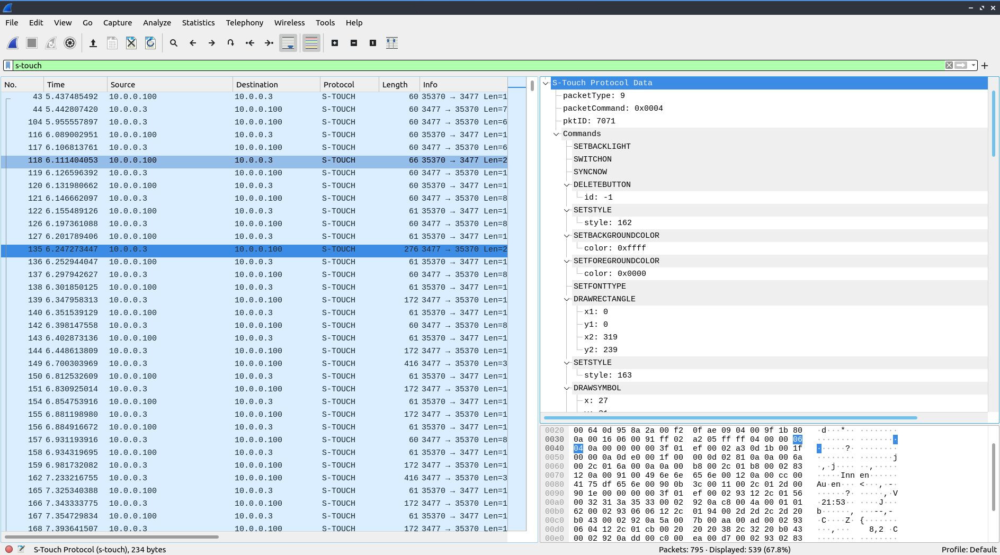
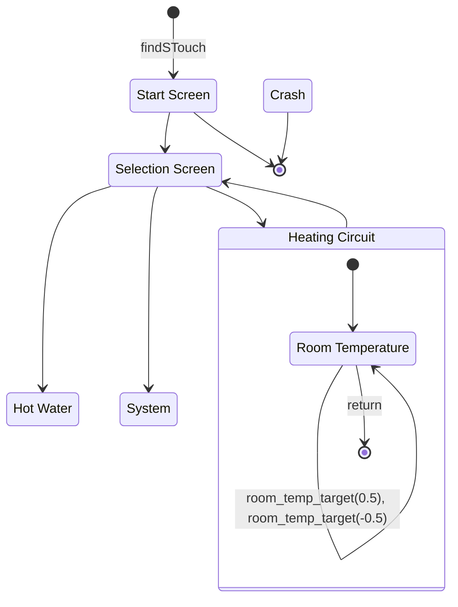

# Reverse Engineering of Protocols

The SystaComfort communicates with the [S-Touch app](https://www.paradigma.de/produkte/regelungen-2/s-touch-app-2/) or the [SystaWeb portal](https://www.paradigma.de/produkte/apps-mehr/systaweb/).

The communication between **SystaPi**  and the SystaComfort is based on the reverse engineering these communication protocols. This page should give an overview on all findings and be a starting point for everyone who wants to contribute to this project.

## S-Touch Protocol

The S-Touch app is providing a canvas on which the SystaComfort is drawing the user interface. This means that there are no easy to use commands for e.g. setting and reading values. If you want to use this protocol for operating the SystaComfort, you have to automate the navigation through the user interface for accessing the information you want. 

### Search for SystaComfort units

The most interesting finding in the protocol was a way to search for SystaComfort units on the network. I have used that information for the [findsystacomfort](https://github.com/beep-projects/SystaPi#findsystacomfort) command and for [systa_test.py](../helpers/systa_test.py ) which is a helper script that you can use to evaluate your setup.

```bash
pi@systapi:~ $ python3 systa_test.py 
----- Search Result -----
MAC: 2CBE9700BEE9
IP: 192.168.11.23
S-Touch Port: None
Name: SystaComfort-II
ID: 0809720001
App: 8
Platform: 9
Version: 1.14.1
Base Version: V0.34
UDP password: None
-------------------------
Your SystaComfort does not support the S-Touch app
-------------------------
---- Connection test ----
Listening for 60s on 192.168.11.1:22460
3 / 3 messages received
your system seems to be properly configured
-------------------------

```

### Wireshark dissector

For analyzing the S-Touch protocol I have started to write a [Wireshark](https://www.wireshark.org/) dissector in Lua. It is far from being finished, but it might be helpful for anyone who wants to continue this path. 
If you want to give it a try, you have to place the [stouch.lua](../helpers/stouch.lua) in the [plugin folder](https://www.wireshark.org/docs/wsug_html_chunked/ChPluginFolders.html) of your Wireshark installation. This folder should be:

```~/.local/lib/wireshark/plugins``` (Linux)  
```%APPDATA%\Wireshark\plugins``` or ```WIRESHARK\plugins``` (Windows)  
```%APPDIR%/Contents/PlugIns/wireshark``` or ```INSTALLDIR/lib/wireshark/plugins``` (macOS)  



### reS-Touch flow chart


